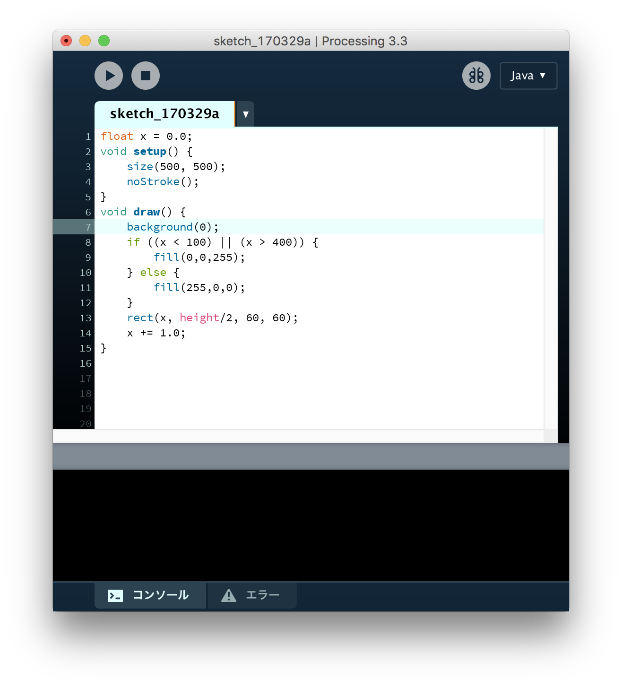
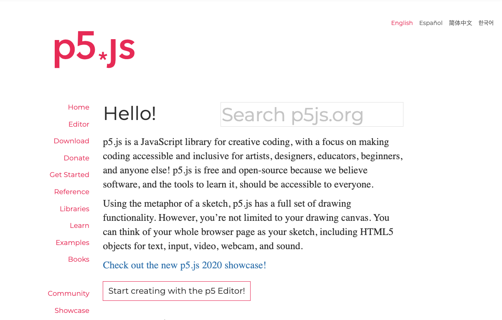
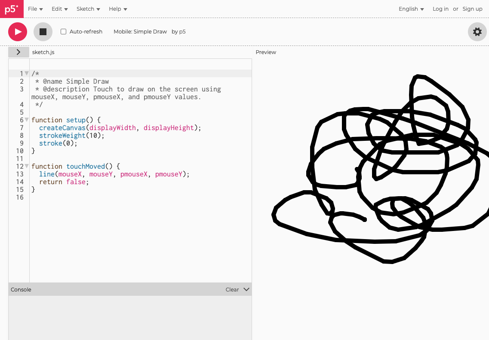
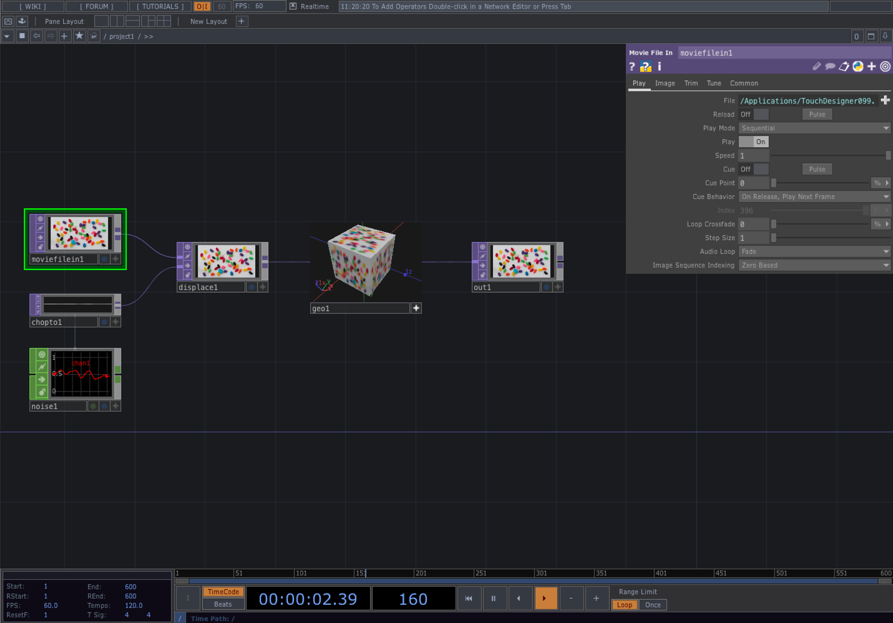

# インタラクティブデザイン概論

---

# デザイナーがプログラミングを学ぶ？

UIUXDコースはデザインを学ぶクラスです。その中でプログラミングを習得するメリットとは。

* 表現の幅が広がる。 
* WebやUIやプログラミングで動いている
* UIデザインをする上で、動作や遷移をより深く理解することができる

<iframe style="border: 1px solid rgba(0, 0, 0, 0.1);" width="800" height="450" src="https://www.figma.com/embed?embed_host=share&url=https%3A%2F%2Fwww.figma.com%2Ffile%2F4mPiv06GErlbIs5fkUa5Gm%2FDH-Interactive%3Fnode-id%3D0%253A1" allowfullscreen></iframe>

&nbsp;
&nbsp;

## ツール

# Processing

2001 - 

[https://www.processing.org/](https://www.processing.org/)

メディア・アートや教育用プログラミングとして開発された。
Casey ReasとBenjamin Fryによるオープンソースプロジェクト。2Dのビジュアル表現に強い。短いコードで描画できるためスケッチ的に使われることも多い。

- 言語：JAVA
- 開発環境：Processing IDE

### 用途
スケッチ、展示、アプリケーション

&nbsp;
&nbsp;

### 事例紹介

#### Flight Patterns
Aaron Koblin

&nbsp;
&nbsp;

#### Planet Orbits -星のあやとり-
DH17Sun

&nbsp;
&nbsp;
&nbsp;
&nbsp;

---

&nbsp;
&nbsp;
&nbsp;
&nbsp;

# p5.js

2015 -

[https://p5js.org/](https://p5js.org/)

p5.jsはProcessingのJavaScript派生版。Webブラウザで表示ができる為広く普及している。

- 言語：JavaScript
- 開発環境：Browser、Editor

&nbsp;
&nbsp;

### 用途
スケッチ、展示、アプリケーション

&nbsp;
&nbsp;

### 事例紹介

#### DOTS by Mayumi Kutsukake

&nbsp;
&nbsp;
&nbsp;
&nbsp;

---

&nbsp;
&nbsp;

# その他のツール

&nbsp;
&nbsp;

## TouchDesigner

DERIVATIVE社からリリースされているリアルタイム・ビジュアル・プログラミングツール。機能を持ったオペレーターと呼ばれるノードを繋いでいきながら作品を作る。

&nbsp;

#### Stillness
THINK AND SENSE

&nbsp;
&nbsp;

#### Paris Attacks : Millions rally for unity in France - Visualization of Location-based big data
Yuko Okamoto

&nbsp;
&nbsp;

## openFrameworks

&nbsp;

[http://openframeworks.cc/](http://openframeworks.cc/)

Zachary Lieberman, Theo Watson, Arturo Castroを中心に開発されたフレームワーク。
2D/3Dのビジュアル表現に強い。Processingより後発でその影響を受けているが、C++で開発するためより高速な処理ができる。多くのアドオンがあり多様な技術を繋ぎ合わせることに特化している。

&nbsp;

#### Sensing Streams
Ryuichi Sakamoto + Daito Manabe 

&nbsp;
&nbsp;

#### Another face ー宝石のもう一つの顔、ラウエ斑点
久保浩子

&nbsp;
&nbsp;
&nbsp;

## Unity

[http://japan.unity3d.com/](http://japan.unity3d.com/)

複数のプラットホームに対応するゲームエンジン。2D/3D空間を持ち物理エンジンが予め搭載されいる。スマホアプリやVR機器への書き出しもできる為、ゲームを中心に幅広く使われている。

- 言語：C#
- 開発環境：総合開発環境

### 用途
ゲーム、アプリケーション、VR

### 事例紹介

&nbsp;

#### Pokémon GO
Niantic

&nbsp;

#### VR [heart beat]

石井奈緒人

&nbsp;
&nbsp;

&nbsp;
&nbsp;

## three.js

ウェブブラウザ上で3D表現を行うJavaScriptライブラリ。GPUを使用するWebGLをレンダリングエンジンとするため、通常のWebサイトよりも高速に処理ができる。
https://threejs.org/

- 言語：JavaScript
- 開発環境：Editor

### 事例紹介

#### Paper Planes

[Paper Planes](https://paperplanes.world/)

&nbsp;
&nbsp;

#### 3D Wheelchair Basketball

[3D Wheelchair Basketball](https://3d-wc-basketball.com/)

&nbsp;
&nbsp;
&nbsp;

---

&nbsp;
&nbsp;
&nbsp;

# デバイス編
## Arduino

入出力ポートを備えた基板マイコン。C++風のArduino言語の統合開発環境から構成される。
Processing、openFramewoks、Maxなどと連動。

### 事例紹介

#### Loop
Panon public

https://youtu.be/56fwv18K9wU

&nbsp;
&nbsp;
&nbsp;

----

&nbsp;
&nbsp;
&nbsp;

# 参考リンク

[Creative Applications](http://www.creativeapplications.net/)

