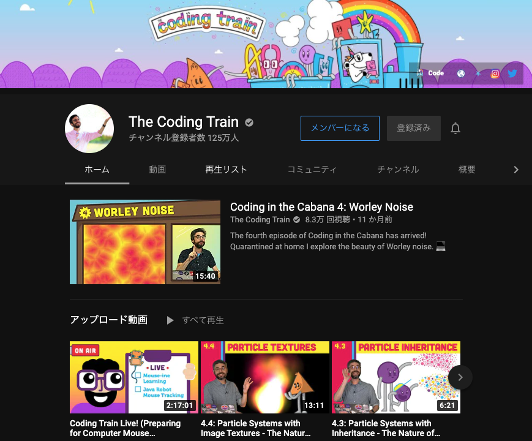
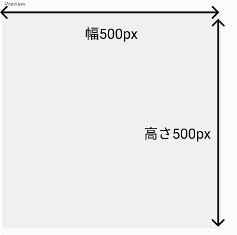
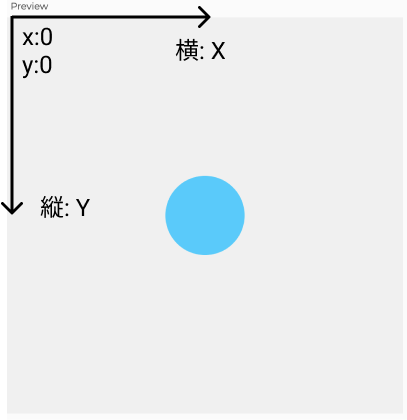
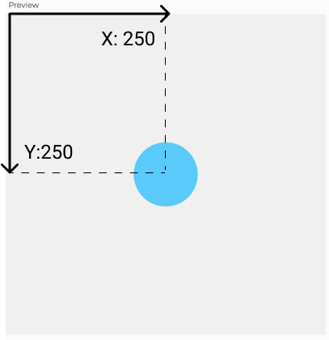
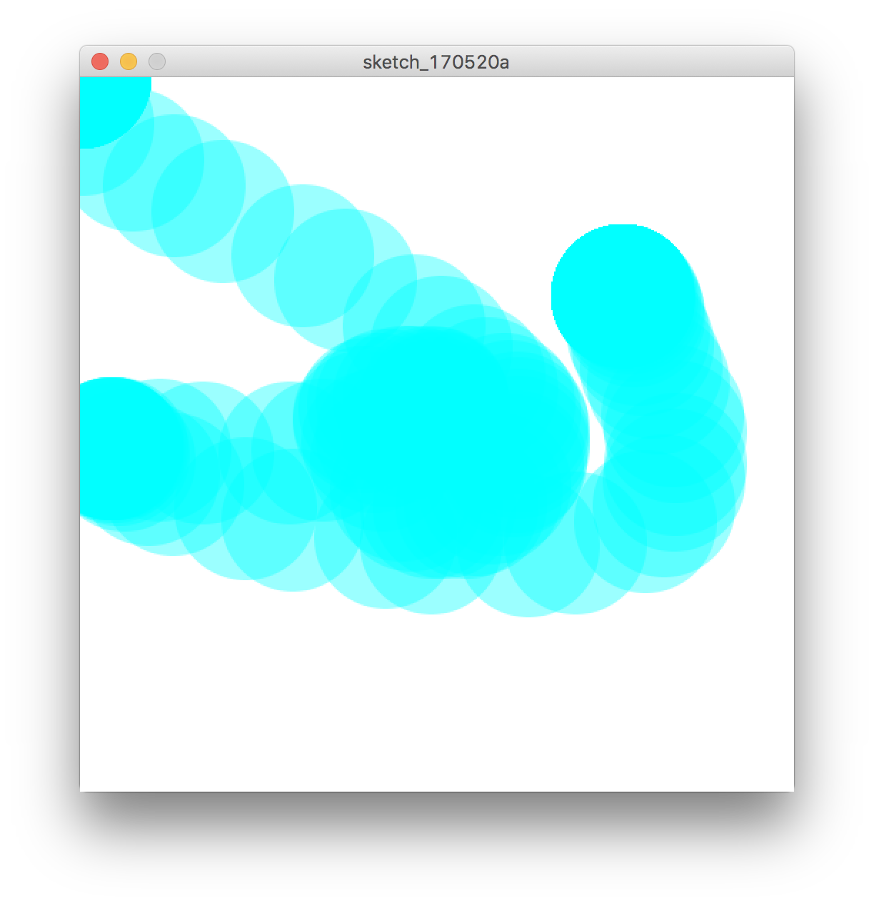

# p5js 基礎


## 公式サイト
[https://p5js.org/](https://p5js.org/)


&nbsp;
&nbsp;

## リファレンス

[公式リファレンス](https://p5js.org/reference/)

&nbsp;
&nbsp;

## 参考図書

どちらも良書ですが、記述がp5js（JavaScript）ではなくProcessing（JAVA）の為、[コードの違い](00_p5js_processing.md)に注意。

  
[Processingをはじめよう](https://www.oreilly.co.jp/books/9784873115153/)

&nbsp;

  
[ジェネラティブ・アート](http://www.bnn.co.jp/books/7199/)


&nbsp;
&nbsp;


## チュートリアル

### The Coding Train



[The Coding Train ](https://www.youtube.com/channel/UCvjgXvBlbQiydffZU7m1_aw)


p5jsプレイリスト:
[Code! Programming for Beginners with p5.js](https://www.youtube.com/watch?v=HerCR8bw_GE&list=PLRqwX-V7Uu6Zy51Q-x9tMWIv9cueOFTFA)


&nbsp;
&nbsp;


---
&nbsp;

## エディタ

プログラムを記述するツール


* [公式オンラインエディタ](https://editor.p5js.org/)

* Webブラウザは[Google Chrome](https://www.google.com/intl/ja_jp/chrome/) を使用
	* Safariでは一部不具合あり 	
* [Visual Studio Code](https://code.visualstudio.com/) でもOK


&nbsp;

## p5jsの記法


* 言語はJavaScript
* すべて半角英数文字で記述する
* 命令文の最後は「;(セミコロン)」で終わる
* 文の途中で改行したり、空の行を入れても影響しない
* 命令文の区切りに半角スペースを入れる
* 単語の区切り以外に半角スペースを使っても影響しない

```
createCanvas(500, 500);
let mainColor;
mainColor = color(255, 166, 231);
fill(mainColor);
circle(250,250,50);

```

&nbsp;

### コメント

* 文中に「コメント」と呼ばれるメモを記述できる。
* コメント内は日本語フォント全角文字を記述できる。
* 1行コメントは「//」
* 複数行コメントは「/\*」と「\*/」で挟む。


```

/* 
初期設定
ここを最初に読み込む
*/

createCanvas(500, 500); //キャンバスのサイズ
let mainColor; // 色の変数 
mainColor = color(255, 166, 231);
fill(mainColor); // 塗り
circle(250,250,50); // 円の描画


```


&nbsp;
&nbsp;
&nbsp;


## createCanvas 領域

描画エリアの領域

** createCanvas(ウインドウの幅,ウインドウの高さ);**

```
createCanvas(500,500);
```



&nbsp;
&nbsp;
&nbsp;

## 座標

描画エリアの左上を基点にして、横がX座標／縦がY座標





&nbsp;
&nbsp;
&nbsp;


## setup と draw

p5jsでは、「setup」「draw」というあらかじめ決められた名前の関数を宣言することで、自動的に繰り返し実行することができます。


### setup
プログラム初期化。最初に読み込む

### draw
メインループ。一定期間ごとに呼び出され、繰り返し実行される


```
//初期設定
function setup() {
  // 最初の1回だけ読み込む
}

//メインループ
function draw() {
  // ここが繰り返される
}

```

&nbsp;
&nbsp;

#### サンプルコード

```
function setup() {
    createCanvas(500,500); // ウインドウのサイズ
    background(255); // 背景
}

function draw() {
    noStroke(); // 線なし
    fill(0,255,255,100); // 塗り
    circle(mouseX,mouseY,100); // 円をマウス座標を中心に描く
}
```



&nbsp;
&nbsp;

