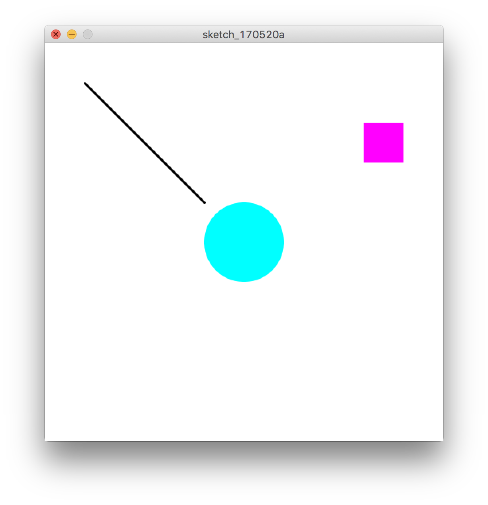
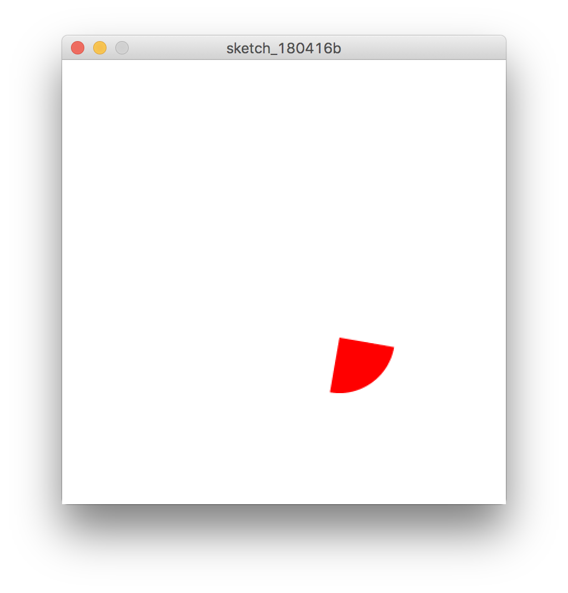
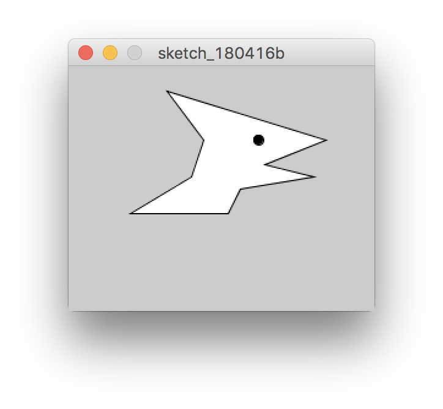

# 図形


### 点 point
`point(x座標,y座標)`


```
point(50, 100);
```

&nbsp;
&nbsp;

### 罫線 line

`line(x1,y1,x2,y2)`

x1は左上のX座標、y1は左上のY座標、x2は右下のX座標、y2は左上の右下Y座標

```
line(30, 20, 85, 75);
```

&nbsp;


### 長方形 rect 
`rect(x1,y1,x2,y2)`

x1は左上のX座標、y1は左上のY座標、x2は右下のX座標、y2は左上の右下Y座標
x2,y2は相対座標なので幅・高さ

```
rect(50, 50, 50, 50);
rect(250, 200, 150, 100);
```

&nbsp;

### 正円 circle
`circle(x, y, diameter)`

x座標、y座標、diameter円の直径

```
circle(200, 200, 100);
```

&nbsp;

### 楕円 ellipse
ellipse(x, y, width, height);  
x座標、y座標、楕円の幅、高さ

```
ellipse(100, 100, 100, 100);
```

&nbsp;

#### サンプルコード
```
createCanvas(500, 500); //ウインドウサイズ
background(255); // 背景色　RGB　0-255 白
noStroke(); // 線なし

fill(0, 255, 255); //塗り
circle(250, 250, 100); //円

fill(255, 0, 255); //塗り
rect(400, 100, 50, 50); //長方形

stroke(0);// 線の色　黒
strokeWeight(3); //線の幅
line(50, 50, 200, 200); // 線

```


&nbsp;

### 三角形 triangle

`triangle(x1,y1,x2,y2,x3,y3)`

x1座標、y1座標、x2座標、y2座標、x3座標、y3座標

```
triangle(12, 180, 120, 15, 160, 60);
```

&nbsp;

### 円弧 arc

`arc(cx,cy,width,height,start,end)`

中心のx座標、中心のy座標、円の幅、円の高さ、開始の角度 ラジアン、終了の角度　ラジアン

```
arc(250, 250, 100, 100, radians(0), radians(270));
```



&nbsp;


### 輪郭図形

```
//輪郭
beginShape(); //描画の開始
vertex(50, 120); //頂点
vertex(100, 90); 
vertex(110, 60); 
vertex(80, 20); 
vertex(210, 60); 
vertex(160, 80); 
vertex(200, 90); 
vertex(140, 100); 
vertex(130, 120); 
endShape(CLOSE); //描画の終了（閉じる）

//目
fill(0);
circle(155, 60, 16, 16);
```


&nbsp;
&nbsp;
&nbsp;

