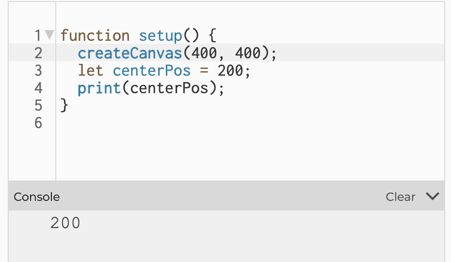
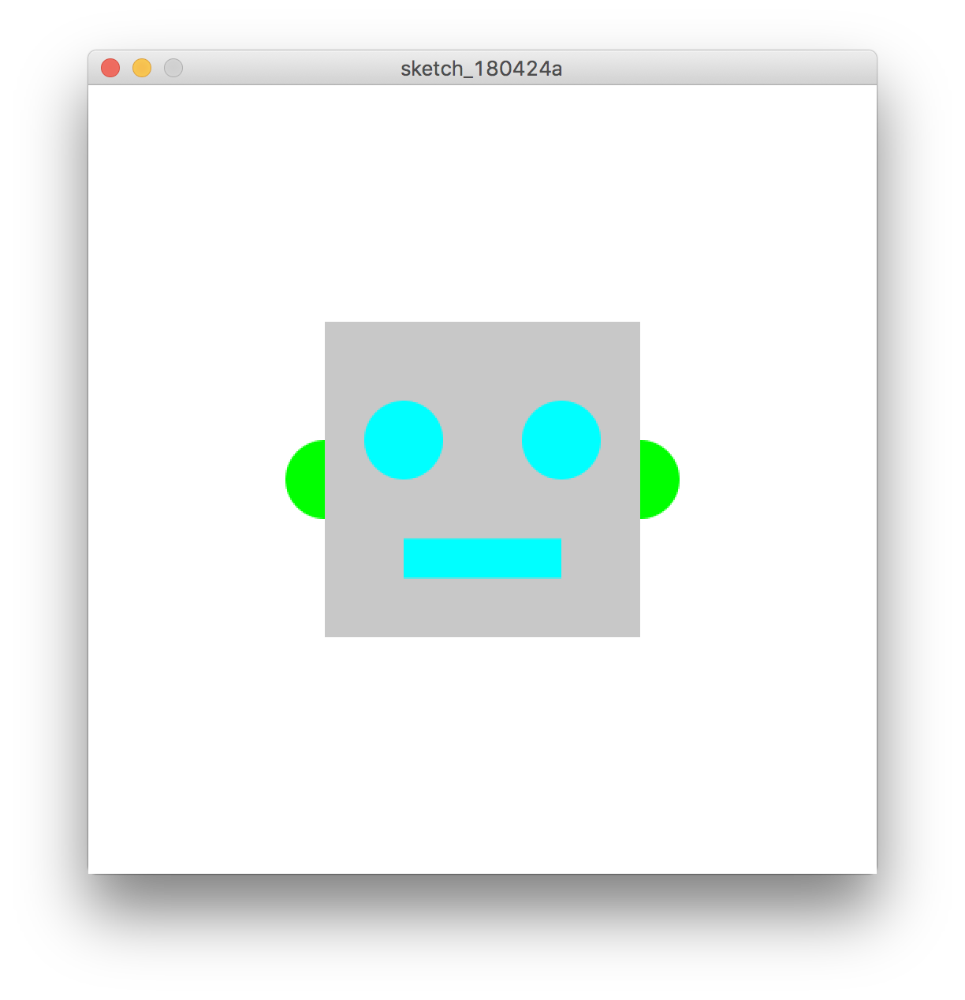

# 変数

プログラムの中では、数値やデータなどの値を保存して使いやすくする為に「変数(へんすう)」という入れ物を用意して扱います。変数は複数作成できるので変数名を命名します。
例えば図形を動かしたり、色を変えたりする場合には、「図形を描く位置」や「図形の色」といった役割のデータを、「あとから中身を変えられる入れ物 」に入れてプログラムを動かします。

変数には好きな名前がつけられますが、先頭に数字が付く名前や、予めJavaScript/p5jsで使われている名称などは変数名で使えません。

&nbsp;

### 数値の保存

```
let numA = 10.0;
let numB = 20.5;
let result = numA + numB;
```

&nbsp;

### 文字列の保存

```
let myName = 'yonekura';
```

&nbsp;

### 命令（関数）の保存


```
let mainColor; // カラー型の変数　mainColorと命名
mainColor = color(255, 166, 231);　// 変数mainColorにRGBカラーを保存
fill(mainColor); // 塗りに変数名を指定
ellipse(400,400,200,200); // 円の描画
```


&nbsp;
&nbsp;


## 変数のタイプ

### var
古いタイプの変数。再宣言が可能であったり、ブロックスコープ（有効範囲）が広かったりと、自由度は高いがセキュリティ的には推奨されない

```
var myNumber = 12;
```

&nbsp;


### let
ECMAScript2015という規格以降に使われる様になった変数。再宣言ができず、ブロックスコープ（有効範囲）内で使用できる変数。基本的にこちらが推奨される。

```
let myNumber = 12;
```


&nbsp;

### const
ECMAScript2015という規格以降に使われる様になった定数。再宣言・再代入ができず、ブロックスコープ（有効範囲）内で使用できる。基本的に値が変わらないデータを保存する為に使われる。

```
const myBirthday = 0907;
```


&nbsp;
&nbsp;


---

&nbsp;
&nbsp;

## 型（参考）

JavaScriptでは型指定は必要ありませんが、本来変数に保存するデータには型（タイプ）が存在する

|データ型 | 内容 |
|:-----------|:------------|
| int       | 整数 |
| float     | 浮動小数点型(小数点以下の数字を含む実数) |
| char       | キャラクタ型(一文字の英数字を文字コードで扱うときに使用する) |
| boolean       | 論理型 |
| byte    | バイト型(8 ビット単位のデジタルデータを使うときに使用する) |


#### int型
整数

```
let num; // int型の変数名numと命名
num = 100; //numに数値「100」を保存
```


&nbsp;

#### float型  
小数点以下の数字を含む実数

```
let num;
num = 10.50;
```


&nbsp;

#### char型
キャラクタ型(一文字の英数字を文字コードで扱うときに使用する)

__""(ダブルコーテーション) 、もしくは''(シングルコーテーション)で囲む__

```
let sample;
sample = "A";
```


&nbsp;

#### color型

カラー型(色設定のデータを扱う)

```
let mainColor;
mainColor = color(255, 166, 231);
fill(mainColor);
```

&nbsp;

#### boolean型

真偽（`true` or `false`）を保存する

```
let isClick; // bool型の変数
isClick = false; // 偽（false）を保存
```

&nbsp;
&nbsp;

---

&nbsp;
&nbsp;

## プリント文　変数の確認方法　

```
let centerPos = 200;
print(centerPos);

```




&nbsp;
&nbsp;


---

&nbsp;
&nbsp;

## システム変数
p5jsが元々用意している変数。この名前を別の用途で上書きすることはできない

* `width` ウインドウの幅
* `height` ウインドウの高さ
* `frameCount` 開始してからのフレームのカウント


&nbsp;
&nbsp;


---

&nbsp;
&nbsp;

## 変数を使った描画

```
function setup(){
    createCanvas(500,500);
    background(255);

    // 顔の色
    const faceColor = color(200);

    // 目と口
    const eyeColor = color(0,255,255);

    //　耳
    const earColor = color(0,255,0);

    // 中心の座標
    const centerX = 250;
    const centerY= 250;

	noStroke(); // 線なし

    // 耳の描画
    fill(earColor);
    circle(centerX-100,centerY,50);
    circle(centerX+100,centerY,50);

    // 輪郭の描画
    fill(faceColor);
    rectMode(CENTER);
    rect(centerX,centerY,200,200);

    // 目の描画
    fill(eyeColor);
    circle(centerX-50,centerY-25,50);
    circle(centerX+50,centerY-25,50);

    // 口の描画
    rect(centerX,centerY+50,100,25);
}

```



&nbsp;
&nbsp;


## グローバル変数とローカル変数

関数の中で作成された変数は**ローカル変数**と呼ばれ、その関数の中でしか使えません。
関数の外側で宣言された変数は**グローバル変数**と呼ばれ、関数の内外両方で使用できます。


```
// グローバル変数。プログラム全体で有効
let x = 2.0; 

function setup(){
  let y = 10.0; // ローカル変数。setup内でのみ有効
}

function draw(){
  print(x); // 数値2.0を出力
  print(y); // エラー。変数yは見つからない
}
```


