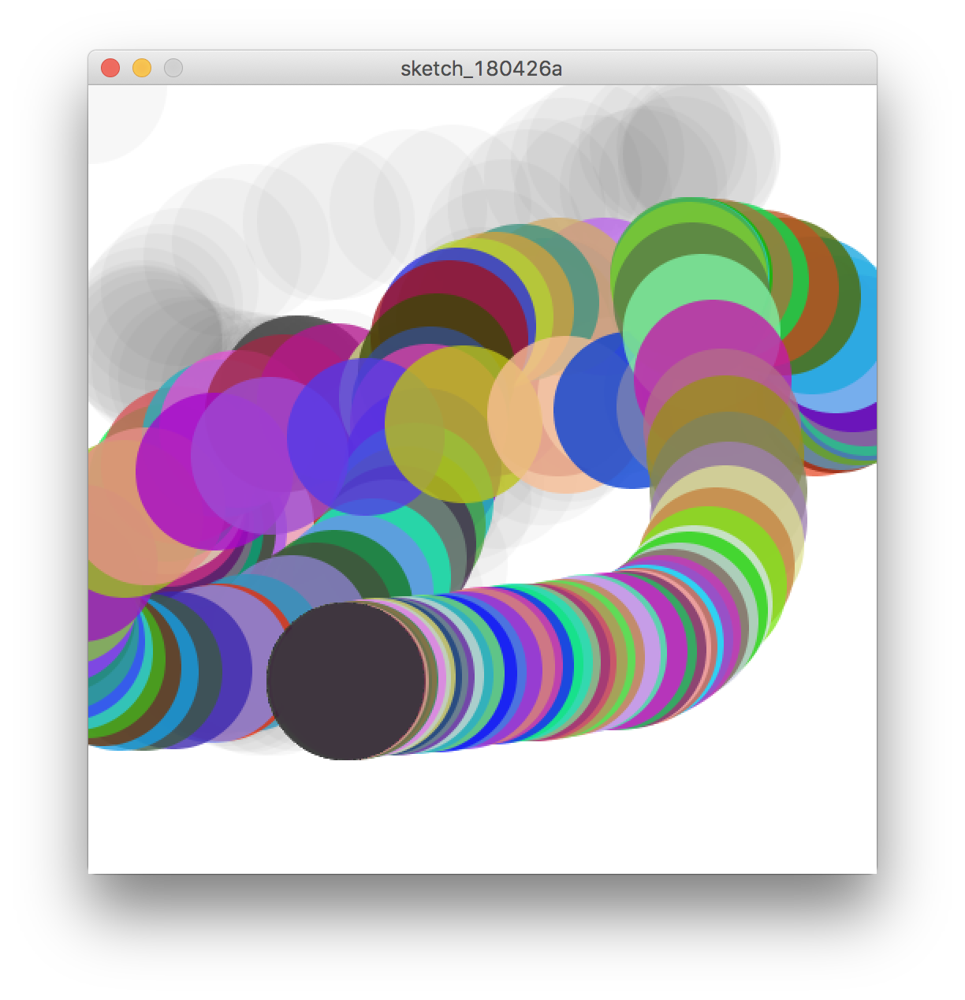

# 条件分岐

if文を使うとプログラムをある条件によって分岐させることができます。

## if文

```
if(条件){
  〜文〜
}
```
条件に合う場合に`{}`内が実行される

```
// もしx座標が画面サイズ以上になったら
if(x > width){
  // xの座標を0に戻す
  x = 0;
}
```

&nbsp;

### 条件式


| 演算子 | 意味 |
|-----------|------------|
| > | より大きい |
| < | より小さい |
| >= | 以上（より大きいか等しい） |
| <= | 以下（より小さいか等しい） |
| == | 等しい |
| != | 等しくない |

&nbsp;
&nbsp;

### if else 


```
if(条件){
  // 条件に合う場合
  〜文〜
} else {
  // 条件に合わない場合
  〜文〜
}
```
elseはifの条件に当てはまらないものが対象となる

```
function draw() {
  noStroke();
  if (mousePressed == true) {
  	 // もしマウスを押していたら
    fill(random(255), random(255), random(255), 200);
  } else {
  	// マウスを押していないとき
    fill(50, 10);
  }
  circle(mouseX, mouseY, 100);
}
```



&nbsp;

### else if


```
if(条件1){
  // 条件1に合う場合
  〜文〜
} else if(条件2) {
  // 条件2に合う場合
  〜文〜
} else{
  // どちらの条件にも合わない場合
  〜文〜
}
```

&nbsp;
&nbsp;

### 論理演算子

| 演算子 | 意味 |
|-----------|------------|
| && | AND |
| \|\| | OR | 
| ! | NOT | 


&nbsp;
&nbsp;

### x座標を元に戻すアニメーション

```
//グローバル変数
let x; //x座標
let speed; //スピード

//初期設定
function setup() {
  createCanvas(500, 500);
  smooth();
  x = width/2; //xの初期位置
  speed = 2; //スピードの値
}


//メインループ
function draw(){
  background(0);
  noStroke();
  fill(255);
  circle(x,250,50);
  x = x + speed; // xの現在地にスピードの値を足していく
  
  // もしx座標が画面サイズ以上になったらxの座標を0に戻す
  if (x >= width) {
      x = -50;
  }
}

```


&nbsp;

### スピードの異なる円

```
//グローバル変数
let x1; //x座標
let x2;
let speed; //スピード

//初期設定
function setup() {
  createCanvas(500, 500);
  smooth();
  x1 = 50; //xの初期位置
  x2 = 50;
  speed = 2; //スピードの値
}

//メインループ
function draw(){
  background(0);
  circle(x1,150,50);
  x1 = x1 + speed; // xの現在地にスピードの値を足していく
  
  circle(x2,350,50);
  if(frameCount % 2 == 0){
    x2 = x2 + speed; // xの現在地にスピードの値を足していく
  }
  print(frameCount);
}
```


&nbsp;
&nbsp;

### 条件の種類　|| (or) / && (and)


&nbsp;
&nbsp;

### X座標の跳ね返り
```
//グローバル変数
let x; //x座標
let speed; //スピード

//初期設定
function setup() {
  createCanvas(500, 500);
  smooth();
  x = width/2; //xの初期位置
  speed = 2; //スピードの値
  
}

//メインループ
function draw(){
  background(0); // drawに背景を入れることで円が重ならなくなる
  x = x + speed; // xの現在地にスピードの値を足していく
  if (x >= width || x < 0 ) {
      speed = -1 * speed;
  }
  noStroke();
  fill(255); // 塗り
  circle(x,250,50);
}


```

&nbsp;
&nbsp;

### XY座標の跳ね返り

```
//グローバル変数
let x; //x座標
let y; //y座標
let speedX; //xのスピード
let speedY; //Yのスピード

//初期設定
function setup() {
  createCanvas(500, 500);
  smooth();
  x = 25; //xの初期位置
  y = 25; //yの初期位置
  speedX = 2; //Xスピードの値
  speedY = 4; //Yスピードの値
  fill(255);
}

//メインループ
function draw(){
  background(0);
  x = x + speedX; // xの現在地にスピードの値を足していく
  y = y + speedY;
  
  //条件分岐　壁でspeedを逆方向にする
  if (x >= width || x < 0 ) {
      speedX = -1 * speedX;
  }
  if (y >= height || y < 0 ) {
      speedY = -1 * speedY;
  }

  noStroke();
  ellipse(x,y,50,50);
}

```

