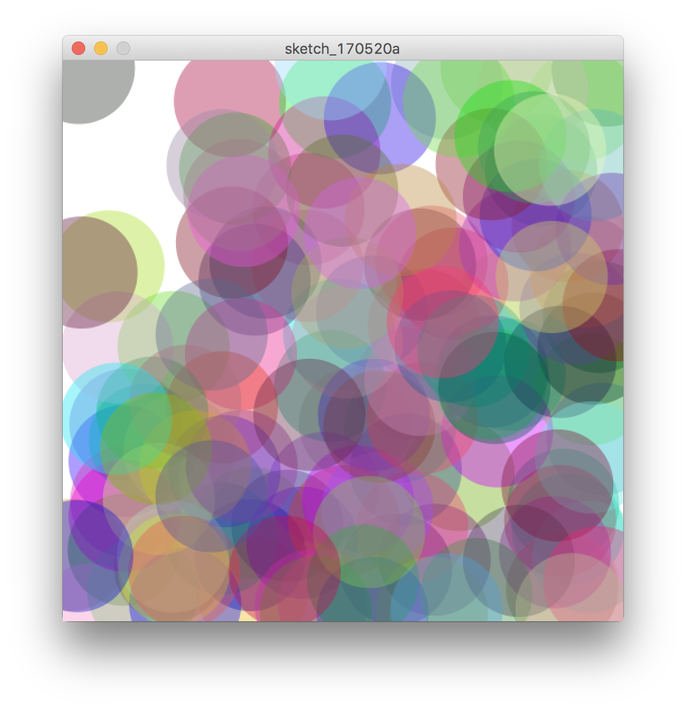
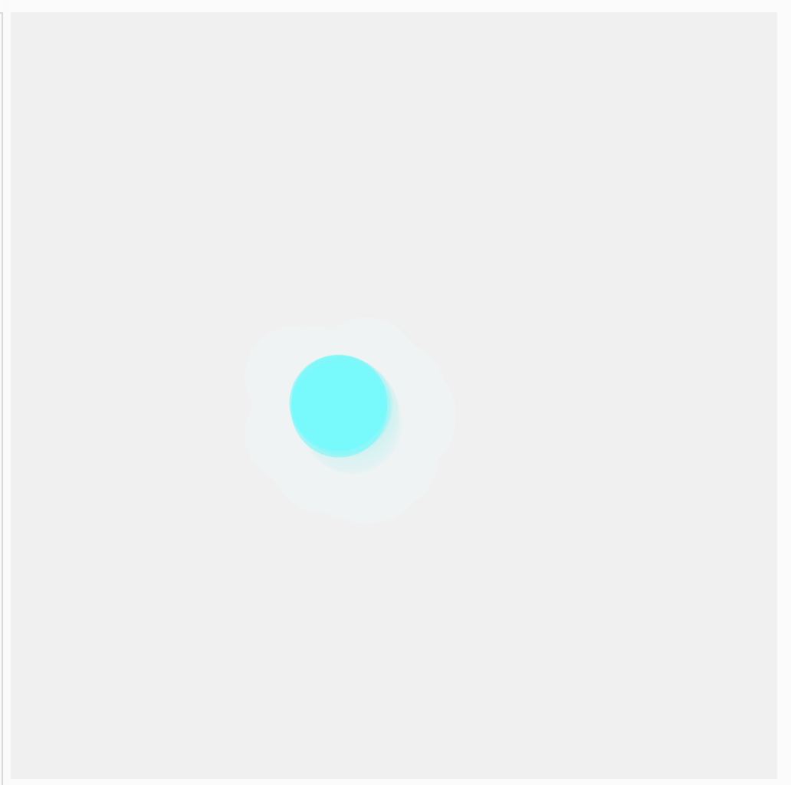
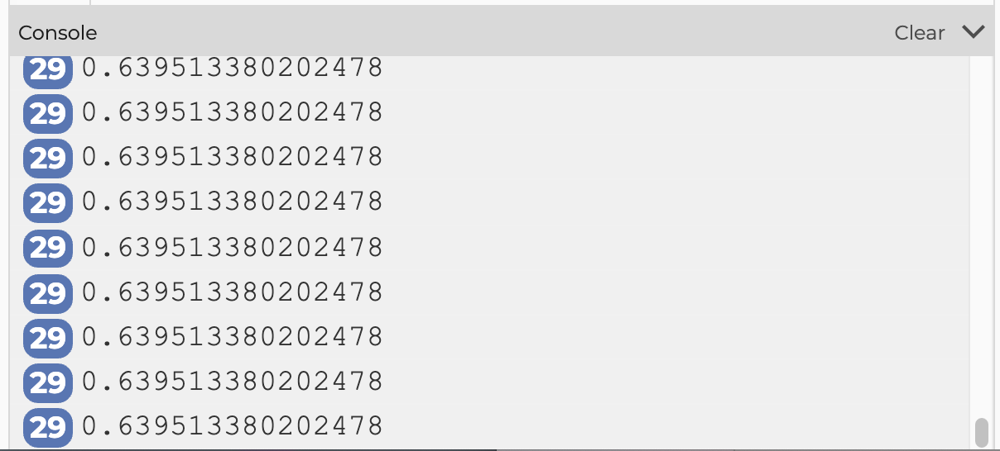
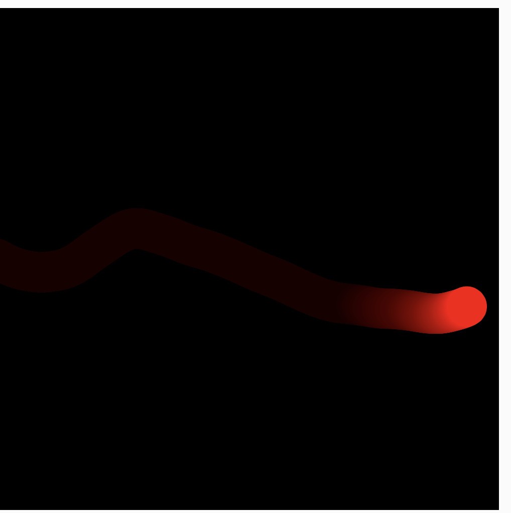
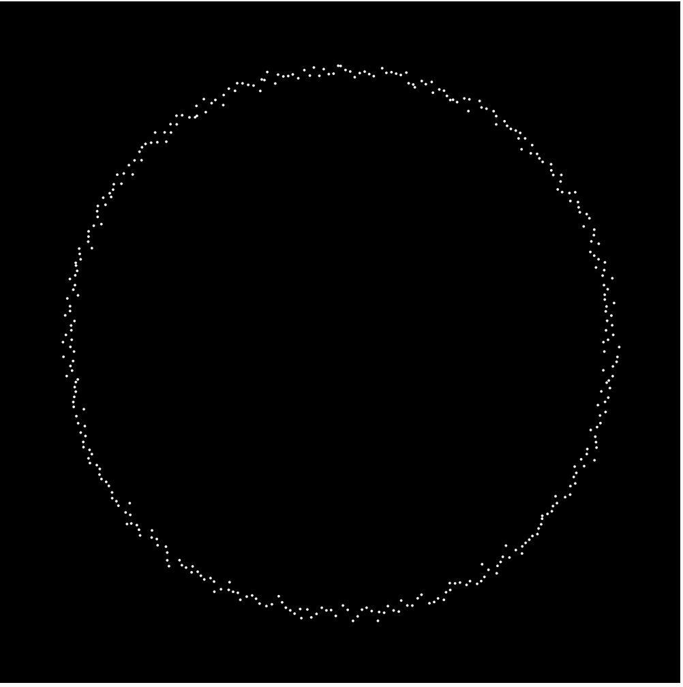

# ランダムとノイズ


参考: [The Book of Shader: ジェネラティブデザイン](https://thebookofshaders.com/10/?lan=jp)


&nbsp;
&nbsp;

## ランダム

ランダムな数値データを作る式。random(128, 256)と指定すると、128以上で256未満の範囲から乱数を1つ生成します。

```
// 50〜200の間でランダムな数値（float）を返す
random(50,200);

```


&nbsp;
&nbsp;

### サンプルコード1


```
function setup() {
    createCanvas(500,500);
    background(255);
    noStroke();
}

function draw() {
    fill(random(0,255),random(0,255),random(0,255),100); // 塗りがランダム
    circle(random(0,500),random(0,500),100); // 円の座標をランダムにして描く
}
```


&nbsp;
&nbsp;

### サンプルコード2 ランダム・ウォーカー


```
// グローバル変数の宣言　コード全体で使える変数
let x;
let y;
let randomX;
let randomY;

function setup() {
  createCanvas(400, 400);
  x = width/2;
  y = height/2;
}

function draw() {
  background(240,50);
  noStroke();
  fill(0,255,255,127);
  circle(x, y, 50); // 円を描画
  
  // -4から4の間でランダムな数値を生成
  randomX = random(-4,4);
  randomY = random(-4,4);
  
  //ランダム値をx座標とx座標に足す
  x = x + randomX;
  y = y + randomY;
}
```



&nbsp;
&nbsp;

---

&nbsp;
&nbsp;


## ノイズ

自然物を表現するときのテクスチャや地形描写などで使われる
パーリンノイズの生成に使う。0.0 から1.0 の間の数値（float）を返す。

```
noise(time);

```


&nbsp;
&nbsp;


#### サンプルコード1
```
let time = 3; //時間

function setup() {
  createCanvas(400, 400);
}

function draw(){
	//ノイズ関数から出力された値 
   let n = noise(time);
   print(n);
}

```



出力結果は同じ値になる


&nbsp;
&nbsp;


#### サンプルコード2
```
let time = 3; //時間

function setup() {
  createCanvas(400, 400);
}

function draw(){
   time += 0.01; //時間の値をインクリメント
   //ノイズ関数から出力された値 
   let n = noise(time);
   print(n);
}

```


出力結果が変動していく

&nbsp;
&nbsp;

#### サンプルコード3

```
// グローバル変数
let x; // 円のX座標
let y; // 円のY座標
let speed; // 円が進むスピード
let time = 3; //時間

function setup() {
  createCanvas(500, 500);
  background(0);
  // 初期値を保存
  x = 0;
  y = height / 2;
  speed = 1.0;
  noStroke();
}

function draw() {
  background(0);
  // 円の塗り
  fill(255, 0, 0);
  // 円の指定
  circle(x, y, 40);
  // posXの現在の値にスピードを加えた値を代入
  x = x + speed;
  

  time += 0.001; //時間の値をインクリメント
  //ノイズ関数から出力された値 
  let n = noise(time);
  let rangeN = map(n, 0, 1 ,-1, 1); 
  y = y + rangeN;
  print(rangeN);
  // if文　条件分岐　xが520を超えたら
  if (x > 520) {
    x = -20; //posXの座標を−20に戻す
  }
}
```


&nbsp;
&nbsp;

#### サンプルコード4
```
// グローバル変数
let time = 3; //時間
let radius = 200;

function setup() {
  createCanvas(500, 500);
  background(0);
  angleMode(RADIANS);
  noStroke();
  translate(width/2, height/2);
  for(let i=0; i<360; i++){
    time += i/100; //時間の値をインクリメント
    let n = noise(time); //ノイズ
    let rangeN = map(n, 0, 1 ,-10, 10); 
    let x = (radius + rangeN) * cos(i);
    let y = (radius + rangeN) * sin(i);
    circle(x, y, 2);
  }
}

function draw() {
  // background(0,5);
}

```




&nbsp;
&nbsp;