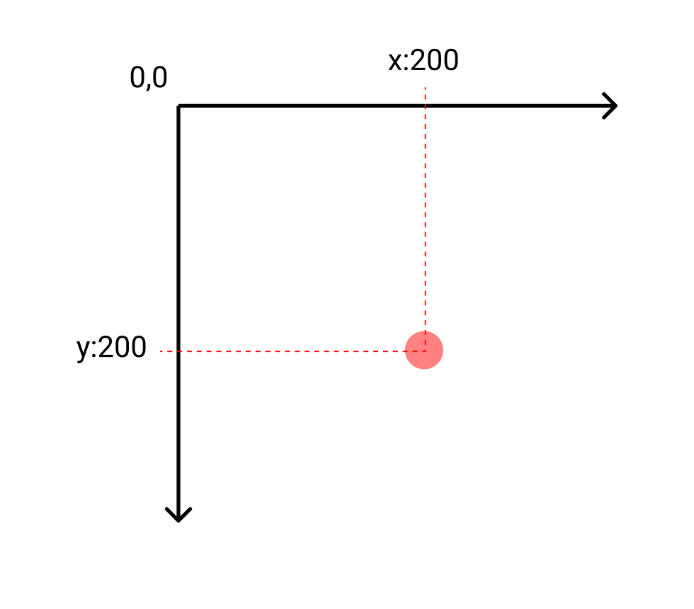
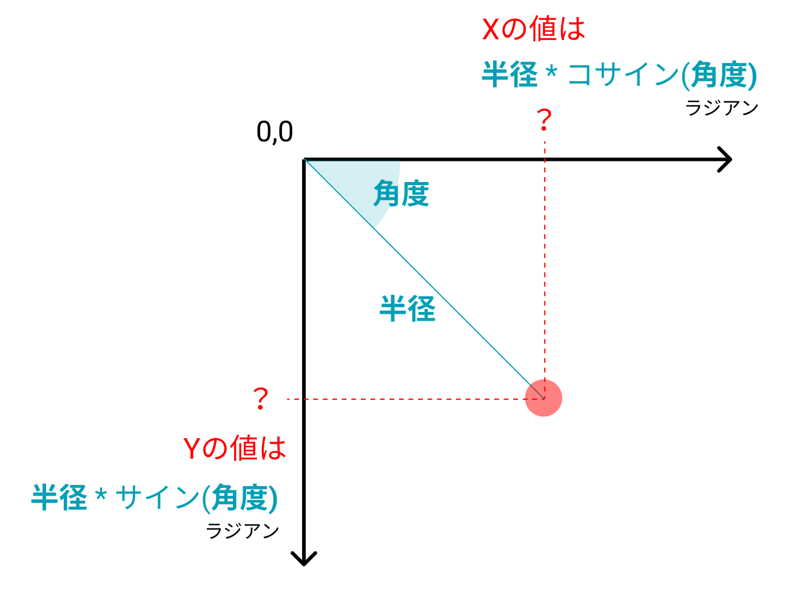
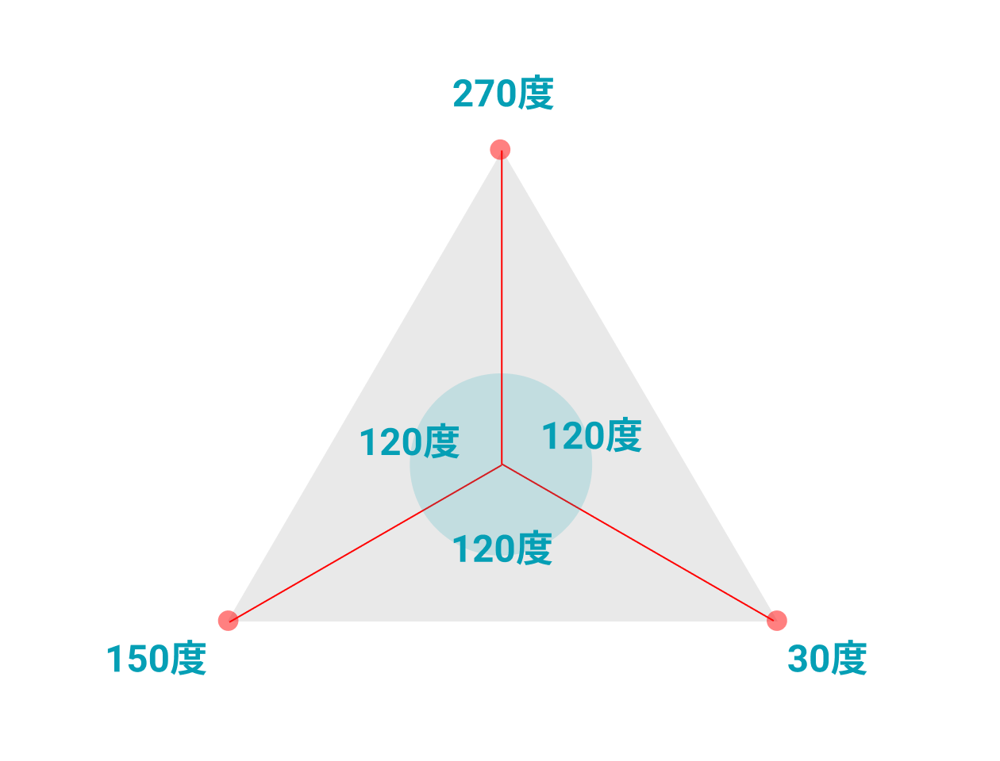

# 三角関数


&nbsp;
&nbsp;


## 直交座標系
X座標とY座標の値から交わるポイントで座標を指定する方法




```
circle(200, 200, 10);

```

&nbsp;
&nbsp;


## 極座標系

半径と角度から座標を指定する方法



#### 円座標の公式

```
x = radius * cos(θ)
y = radius * sin(θ)
```

&nbsp;
&nbsp;


## 三角関数を使って中心から正三角形を描く




```
let x;
let y;
let radius;
function setup(){
  createCanvas(500, 500);
  background(255);
  noStroke();
  fill(100);
  //初期位置
  x = width/2;
  y = height/2;
  radius = 200; //半径
  //三角形を描く
  triangle(
    x + radius * cos(radians(30)), 
    y + radius * sin(radians(30)),
    x + radius * cos(radians(150)),
    y + radius * sin(radians(150)),
    x + radius * cos(radians(270)),
    y + radius * sin(radians(270))
  );
}

function draw(){
}
```

&nbsp;
&nbsp;


## 三角関数


### Sin波のアニメーション

```
const radius = 100; //波の半径 
let degree = 0; // 角度
let rad = 0; // 角度をラジアンに置き換えた値
let x = 0; // X座標

function setup() {
    createCanvas(500, 500);
    background(0);
}


function draw() {
	translate(0, height/2); // 座標変換で描画の中心を高さの中央に移動
	rad = radians(degree); // 角度をラジアンに変換
	let y = radius * sin(rad); // 点のY座標を三角関数で計算
	stroke(0, 255, 0); // 点の色
	strokeWeight(4); // 点の太さ
	point(x, y); // 点の描画
	degree ++; // 角度を1ずつ増やしていく
	x++; // X座標を1ずつ増やしていく
}
```


&nbsp;
&nbsp;


### Sin / Cos を使って円の描画

X座標をコサイン、Y座標をサインで計算すると円を描く

```
// グローバル変数
let hue; // 色相
let speed; // 円が進むスピード
let theta; // 円の角度
let radius; //円の半径


function setup(){
  createCanvas(500, 500);
  noStroke();
  
  // 変数に初期値を保存
  hue = 0;
  speed = 1;
  radius = 200;
  theta = 0;
}


function draw(){
  //background(0);
  
  // 円を軌跡を表示するために半透明の四角形を敷く
  fill(0, 10);
  rect(0, 0, width, height);
  
  
  // 座標変換で円の基点を画面の中央に
  translate(width/2, height/2);
  
  // カラーモードをHSB（色相・彩度・明度・アルファ）に変更
  colorMode(HSB, 360, 100, 100, 100);
  
  // 円の塗り
  fill(hue, 100, 100, 80);
  
  // 三角関数でX座標Y座標を指定
  let x = radius * cos(radians(theta));
  let y = radius * sin(radians(theta));
  
  // 円の指定
  circle(x,y,20);
 
  // 角度にスピードを代入
  theta = theta + speed;
  
  //もし角度が360を超えたら角度を0に戻す
  if(theta>360){
    theta = 0;
  }
}

```


&nbsp;
&nbsp;


### サンプルコード

マウスのY座標の上下でスピードがマウスのX座標の左右で円の半径が代わる

```
// グローバル変数
let hue; // 色相
let speed; // 円が進むスピード
let theta; // 円の角度
let radius; //円の半径


function setup(){
  createCanvas(500,500);
  noStroke();
  
  // 変数に初期値を保存
  hue = 0;
  speed = 1;
  radius = 200;
  theta = 0;
}


function draw(){
  //background(0);
  
  // 円を軌跡を表示するために半透明の四角形を敷く
  fill(0,10);
  rect(0,0,width,height);
  
  
  // 座標変換で円の基点を画面の中央に
  translate(width/2,height/2);
  
  // カラーモードをHSB（色相・彩度・明度・アルファ）に変更
  colorMode(HSB,360,100,100,100);
  
  // 円の塗り
  fill(hue,100,100,80);
  
  // 三角関数でX座標Y座標を指定
  let x = radius * cos(radians(theta));
  let y = radius * sin(radians(theta));
  
  // 円の指定
  circle(x,y,20);
  
  // マウスY座標（0〜500の値）をスピード1〜8の値に置き換えスピードに代入
  speed = map(mouseY,0,500,1,8);
  
  // マウスX座標（0〜500の値）を円の半径40〜200に置き換えて代入
  radius = map(mouseX,0,500,40,200);
 
  // 角度にスピードを代入
  theta = theta + speed;
  
  //もし角度が360を超えたら角度を0に戻す
  if(theta>360){
    theta = 0;
  }
  
  // 色相の値に1を足す
  hue = hue + 1;
  
  // もし色相の値が360を超えたら
  if(hue>360){
    // 色相の値を0に戻す
    hue = 0;
  }
}
```


&nbsp;
&nbsp;
&nbsp;
&nbsp;

&nbsp;
&nbsp;
