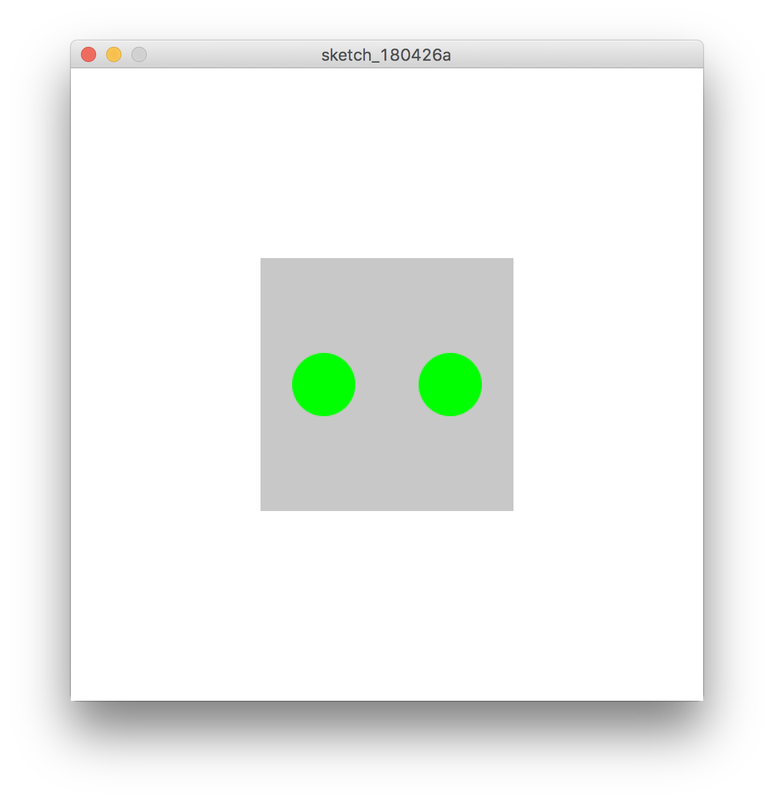

# 関数 function

関数（かんすう）とはプログラムの中で使う命令をひとまとめにして、名前をつけておく仕組みのことです。関数を作ることでプログラムを機能別のブロックに分けたり、 名前を呼び出して何度も使い回すことができます。

&nbsp;
&nbsp;


## 関数の記法（引数無し、戻り値無し）

命令をひとまとまりにし、名前を呼び出すことで実行される

```
function 関数名(){
	〜文〜
}

```

```
function setup(){
  createCanvas(500,500);
}

function draw(){
   background(255);
   // 関数の実行 これを書かないと実行されない
   makeRobot();
}

// 関数の作成 ここが命令をまとめている
void makeRobot(){
  // 輪郭
  noStroke();
  fill(200);
  rectMode(CENTER);
  rect(250, 250,200,200);
  fill(0,255,0);
  ellipse(200,250,50,50);
  ellipse(300,250,50,50);
}

```



&nbsp;
&nbsp;

## 関数の記法（引数有り、戻り値無し）

命令に引数（ひきすう）と呼ばれる値を渡すと、値を元に実行される

```
function 関数名(引数){
	〜文〜
}

```

```
function setup(){
  createCanvas(500,500);
}
function draw(){
   background(255);
   // 関数の実行 これを書かないと実行されない
   makeRobot(250,250);
}

// 関数の作成 ここが命令をまとめている 
function makeRobot(x, y){
  // 輪郭
  noStroke();
  fill(200);
  rectMode(CENTER);
  rect(x, y,200,200);
  fill(0,255,0);
  ellipse(x-50,y-25,50,50);
  ellipse(x+50,y-25,50,50);
}

```

&nbsp;
&nbsp;

## 関数の記法（ 引数有り、戻り値有り）

関数内で「retun 変数」と記述すると、変数の値を返してくれる

```
function　関数名(引数){
	〜文〜
	return 変数
}

```
```
function setup(){
  createCanvas(500,500);
}
function draw(){
   background(255);
   // 関数の実行 これを書かないと実行されない
   makeRobot(250,250);
}

// 関数の作成 ここが命令をまとめている 
function makeRobot(x, y){
  // 輪郭
  noStroke();
  fill(randomColor(0,50));
  rectMode(CENTER);
  rect(x, y,200,200);
  fill(randomColor(200,300));
  ellipse(x-50,y-25,50,50);
  ellipse(x+50,y-25,50,50);
}

//ランダムな色を返す関数
function randomColor(hueA, hueB){
  // カラーモードをHSB（色相・彩度・明度）
  colorMode(HSB, 360, 100, 100);
  // 変数cにランダムな色相を保存
  let c = color(random(hueA,hueB),100,100);
  // cの値を返す
  return c;
}
```


