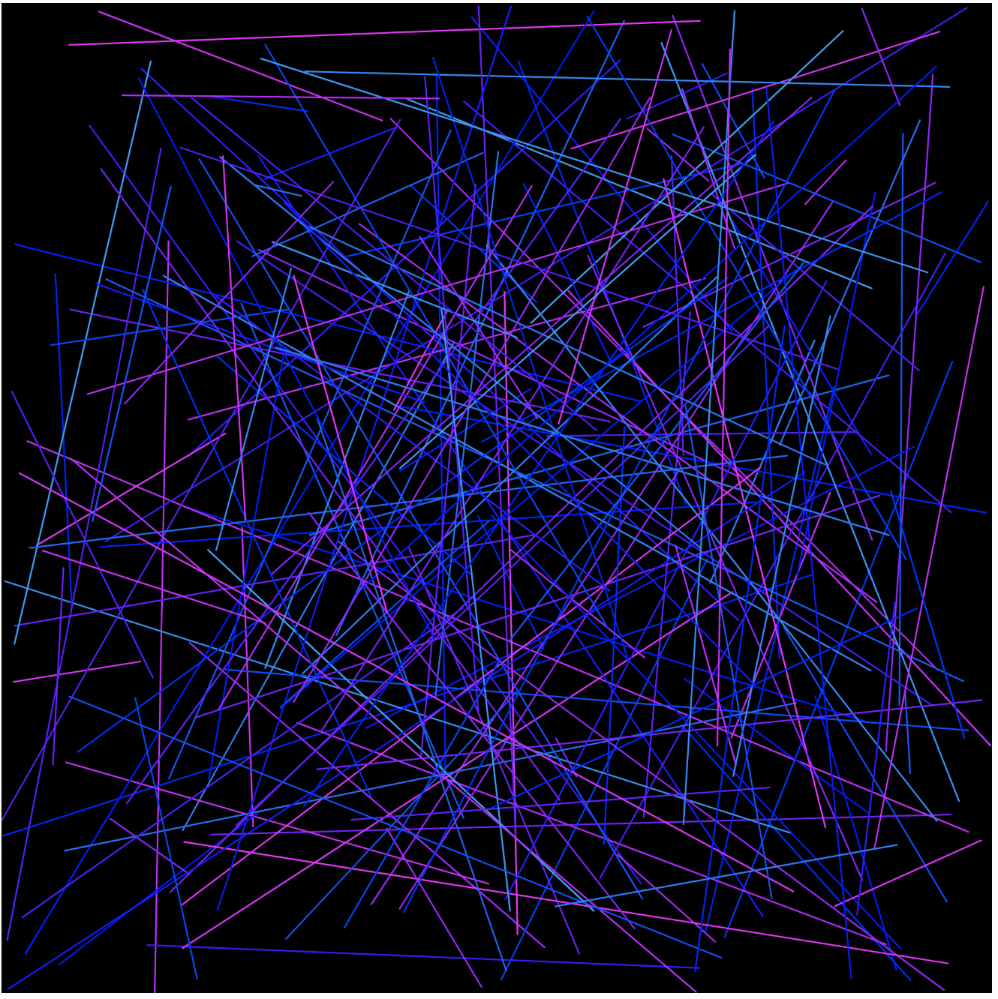
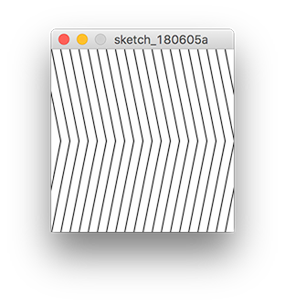
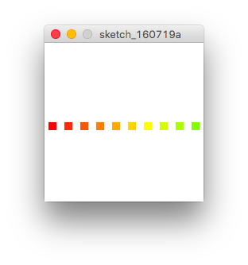
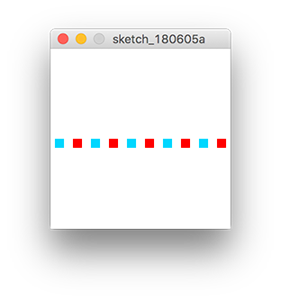
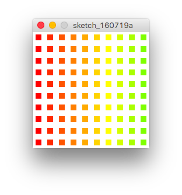

# ループ

## for文

反復作業を正確にすばやく実行する


### for文の記法

```
for (初期化; 条件; 更新 ){
	文
}

```

&nbsp;


### for文のサンプルコード

```
void setup(){
  size(200,200);
  background(255);
  // 初期値-20、220未満まで、10ずつ増える
  for(int i = -20; i < 220; i += 10){
    // 変数iがラインの高さに代入される
    line(0, i, 200, i + 20);
  }
}
```


&nbsp;

### for文の組み合わせ

```
void setup(){
  size(200,200);
  background(255);
  stroke(0);
  
  // 初期値-10、200未満まで、10ずつ増える
  for(int i = -10; i < 200; i += 10){
      line(i, 0, i+20, 100);
  }
  // 初期値10、220以下まで、10ずつ増える
  for(int i = 10; i <= 220; i += 10){
      line(i, 100, i-20, 200);
  }
}
```


&nbsp;


### for文を使ってグラーデーションを表現

```
void setup(){
	size(200,200);
	background(255);
	colorMode(HSB,360,100,100);
	noStroke();
	// 初期値0、10未満まで、1ずつ増える
	for(int i=0; i<10; i++){
	  fill(i*10, 100, 100);
	  rect(i*20+5, width/2, 10, 10);
	}
}
```



&nbsp;

### forとifの組み合わせ


```
void setup(){
  size(200,200);
  background(255);
  colorMode(HSB,360,100,100);
  noStroke();
  // 初期値0、10未満まで、1ずつ増える
  for(int i=0; i<10; i++){
    fill(10, 100, 100);
    if(i % 2 == 0){
      // 変数iを2で割った余りが0なら
      fill(190, 100, 100);
    } else {
      fill(10, 100, 100);
    }
    rect(i*20+5,width/2,10,10);
  }
}
```


&nbsp;

### forの入れ子


```
void setup(){
	size(200,200);
	background(255);
	colorMode(HSB,360,100,100);
	noStroke();
	// 初期値0、10未満まで、1ずつ増える
	for(int y=0; y < 10; y++){
	  // 初期値0、10未満まで、1ずつ増えるs
	  for(int x=0; x < 10; x++){
	    fill(x*10, 10+ y*10, 100);
	    rect(x*20+5,y*20+5,10,10);
	  }
	}
}
```




&nbsp;
&nbsp;

&nbsp;
&nbsp;


