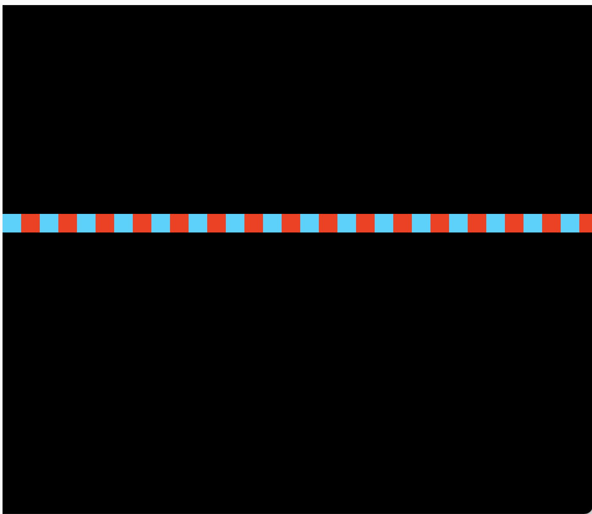
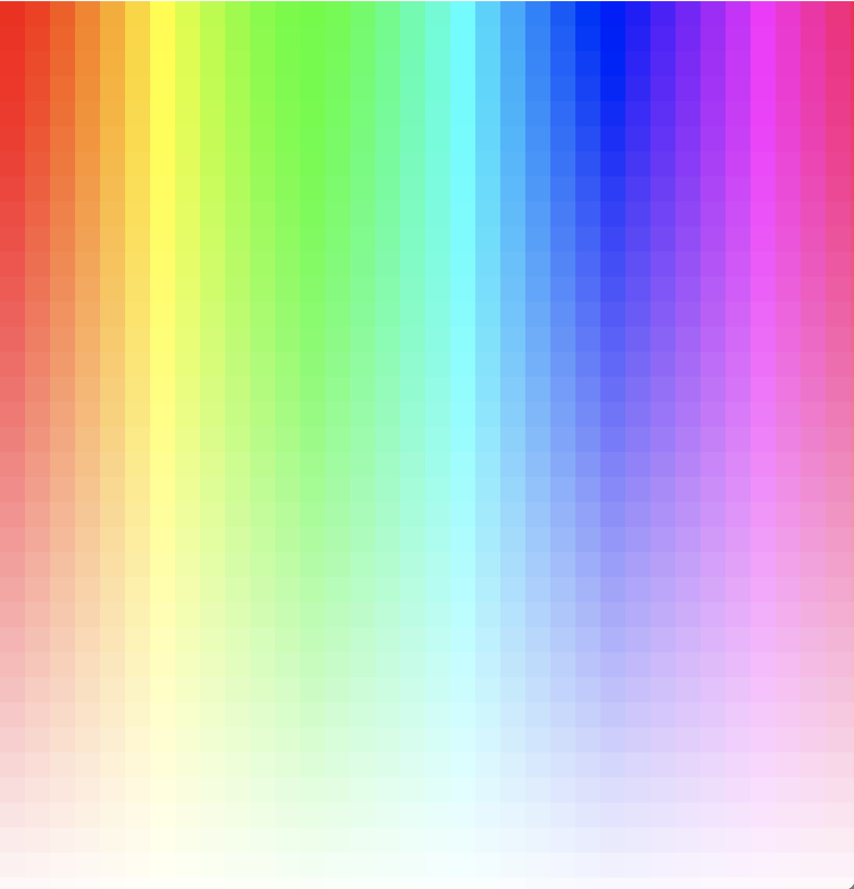

# ループ

## for文

反復作業を即時に実行する


### for文の記法

```
for (初期化; 条件; 更新 ){
	文
}

```


```
for (let i = 0; i < 100; i++ ){
	//0から99まで1ずつ
	print(i);
}

```

&nbsp;


### for文のサンプルコード

```
function setup() {
  createCanvas(600, 600);
  background(0);
  noFill();
  colorMode(HSB, 360, 100, 100);
  for (let i = 0; i < 200; i++) {
    stroke(random(200, 300), 100, 100);
    line(
      random(0, width),
      random(0, height),
      random(0, width),
      random(0, height)
    );
  }
}

function draw() {}

```


&nbsp;
&nbsp;

<!--
### for文の組み合わせ

```
function setup(){
  createCanvas(200,200);
  background(255);
  stroke(0);
  
  // 初期値-10、200未満まで、10ずつ増える
  for(int i = -10; i < 200; i += 10){
      line(i, 0, i+20, 100);
  }
  // 初期値10、220以下まで、10ずつ増える
  for(int i = 10; i <= 220; i += 10){
      line(i, 100, i-20, 200);
  }
}
```


&nbsp;
-->


### for文を使ってグラーデーションを表現

```
function setup() {
  createCanvas(720, 720);
  background(0);
  noStroke();
  colorMode(HSB, 360, 100, 100);
  for (let x = 0; x < 36; x++) {
    //変数xは0から36まで1ずつ増える
    fill(x*10, 100, 100);
    rect(x * 20, height / 2, 20, 20);
  }
}

function draw() {}

```


&nbsp;
&nbsp;

### forとifの組み合わせ


```
function setup() {
  createCanvas(720, 720);
  background(0);
  noStroke();
  colorMode(HSB, 360, 100, 100);
  for (let x = 0; x < 36; x++) {
    //変数xは0から36まで1ずつ増える
    if (x % 2 == 0) {
      fill(190, 100, 100);
    } else {
      fill(10, 100, 100);
    }
    rect(x * 20, height / 2, 20, 20);
  }
}

function draw() {}
```


&nbsp;
&nbsp;

### forの入れ子


```
function setup() {
  createCanvas(720, 720);
  background(0);
  noStroke();
  colorMode(HSB, 360, 100, 100);
  for (let y = 0; y < 36; y++) {
    for (let x = 0; x < 36; x++) {
      //0から36の値を100から0に置き換える
      let sat = map(y,0,36,100,0);
      fill(x * 10, sat, 100);
      rect(x * 20, y * 20, 20, 20);
      
      print(sat);
    }
  }
}

function draw() {}
```




&nbsp;
&nbsp;

&nbsp;
&nbsp;


