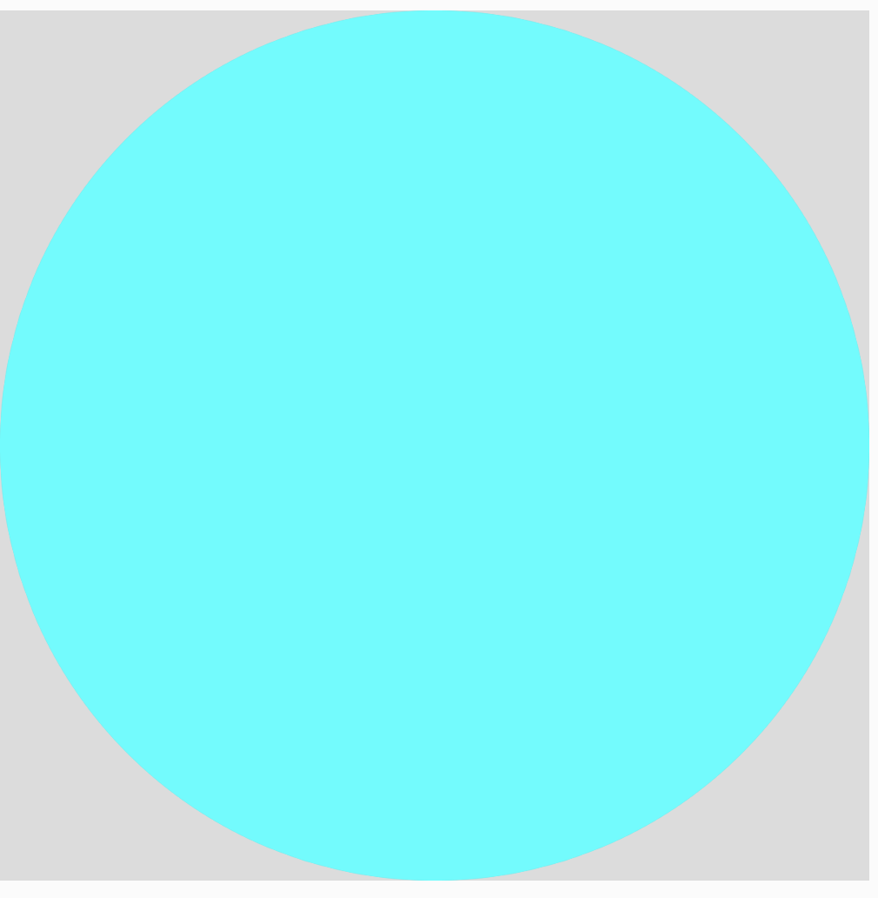
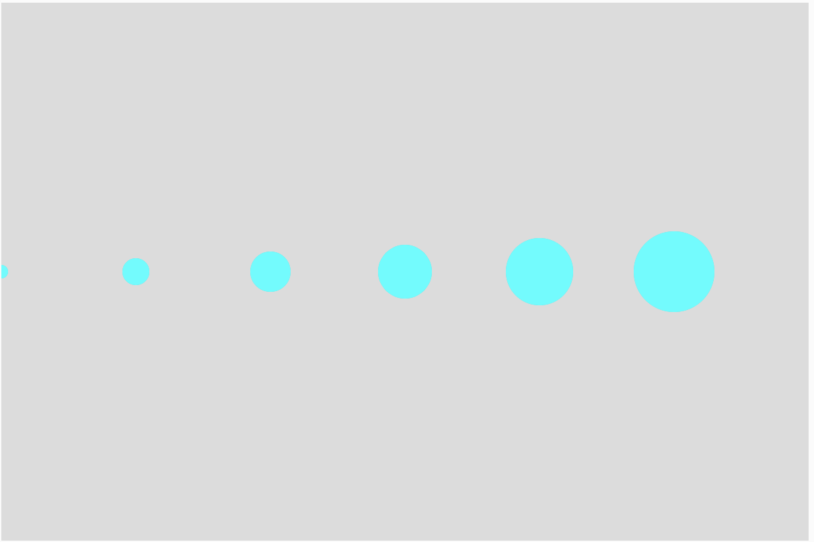
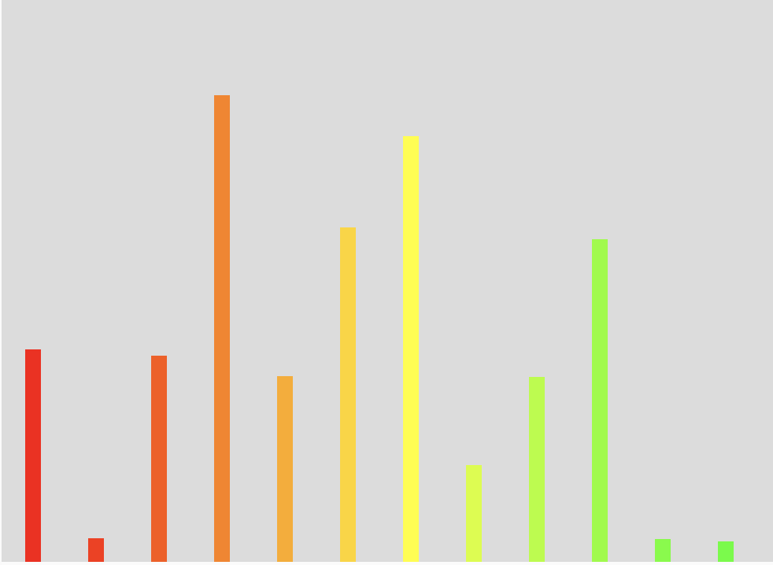
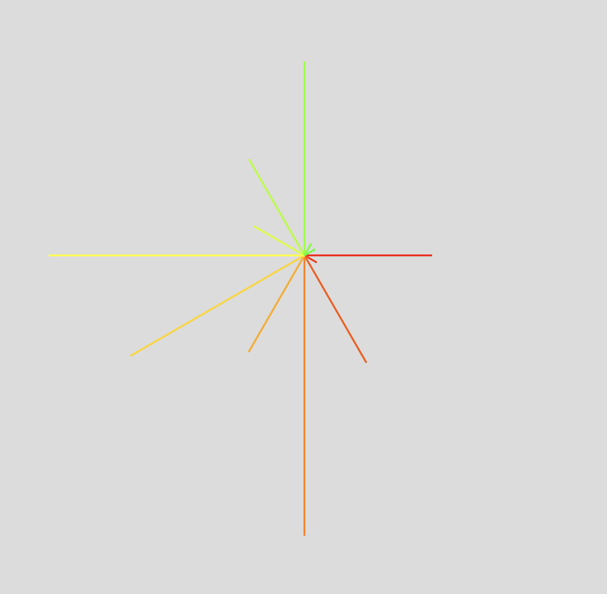
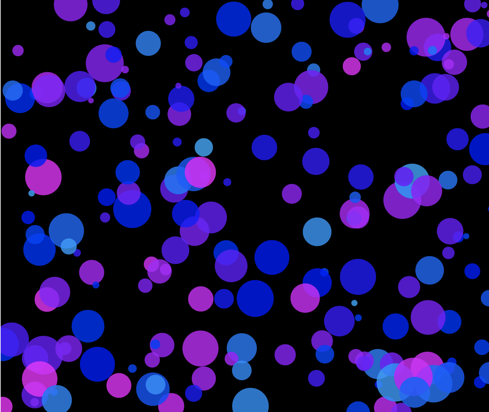

# 配列

変数はひとつの宣言に対して、ひとつの値しか保存できないが、変数を配列化することで複数の値を保持することができる。
また番号（0はじまり）で値を管理することができる。

### 配列宣言

```
let 変数名前 = [];
```


&nbsp;
&nbsp;

### int型配列

```
// 配列の作成
let myArr = [];
// 配列myArrにデータを保存
myArr[0] = 100;
myArr[1] = 200;
myArr[2] = 300;
myArr[3] = 400;
myArr[4] = 500;

print(myArr[1]);
// コンソールの結果は20
```


&nbsp;
&nbsp;


```
// 配列の作成
let myArr = [];

function setup() {
  createCanvas(400, 400);
  
  // 配列myArrにデータを保存
  myArr[0] = 100;
  myArr[1] = 200;
  myArr[2] = 300;
  myArr[3] = 400;
  myArr[4] = 500;
  print(myArr[1]);
}

function draw() {
  background(220);
  noStroke();
  fill(0,255,255);
  circle(width/2, height/2, myArr[3]);
}
```



&nbsp;
&nbsp;


### 宣言を省略した記述方法

```
let myArr = [100,200,300,400,500];
```

&nbsp;

#### 配列の数を調べる

`length`


```
print(myArr.length);

```

&nbsp;
&nbsp;

## 配列とforを組み合わせる

```
const circleDia =[10,20,30,40,50,60];
function setup() {
  createCanvas(600, 400);
  background(220);
  noStroke();
  fill(0,255,255);
  
  for(let i=0; i<circleDia.length; i+=1){
    circle(i*100, height/2, circleDia[i]);
  }
}

function draw() { }
```




&nbsp;
&nbsp;

## サンプルコード

### 降水量を元にグラフを作成する

[気象庁:過去の気象データ](https://www.data.jma.go.jp/obd/stats/etrn/view/monthly_s3.php?prec_no=44&block_no=47662&year=&month=&day=&view=p5)

```
// 東京都　2020年（月ごとの合計）降水量(mm)配列
let tokyo_rainfall = [135.0,15.0,131.0,296.5,118.0,212.5,270.5,61.5,117.5,205.0,14.5,13.0];

function setup() {
  createCanvas(720, 400);
  background(220);
  colorMode(HSB, 360, 100, 100);
  for (let i = 0; i < tokyo_rainfall.length; i += 1) {
    strokeWeight(10);
    strokeCap(SQUARE);
    stroke(i * 10, 100, 100);
    line(i * 40 + 20, height, i * 40 + 20, height - tokyo_rainfall[i]);
  }
}

function draw() {}
```



```
// 東京都　2020年（月ごとの合計）降水量(mm)配列
let tokyo_rainfall = [135.0,15.0,131.0,296.5,118.0,212.5,270.5,61.5,117.5,205.0,14.5,13.0];

function setup() {
  createCanvas(720, 720);
  background(220);
  colorMode(HSB, 360, 100, 100);
  translate(width/2, height/2);
  for (let i = 0; i < tokyo_rainfall.length; i += 1) {
    strokeWeight(2);
    strokeCap(SQUARE);
    
    let radius = tokyo_rainfall[i];
    let x = radius * cos(radians(i*30));
    let y = radius * sin(radians(i*30));
    stroke(i * 10, 100, 100);
    line(0, 0, x, y);
  }
}

function draw() {}

```



&nbsp;
&nbsp;

### カラフルな円が動き回る

```
let x = [];
let y = [];
let speedX = [];
let speedY = [];
const NUM = 200;
let diameter = [];
let hue = [];

function setup() {
  createCanvas(windowWidth, windowHeight);
  background(0);
  noStroke();
  colorMode(HSB, 360, 100, 100, 100);

  for (let i = 0; i < NUM; i++) {
    x[i] = width / 2;
    y[i] = height / 2;
    speedX[i] = random(-4, 4);
    speedY[i] = random(-4, 4);
    diameter[i] = random(8, 60);
    hue[i] = int(random(200, 300));
  }
}

function draw() {
  background(0);

  for (let i = 0; i < NUM; i++) {
    fill(hue[i], 100, 100, 80);
    circle(x[i], y[i], diameter[i]);
    x[i] += speedX[i];
    y[i] += speedY[i];

    if (x[i] > width) {
      speedX[i] *= -1;
    }
    if (x[i] < 0) {
      speedX[i] *= -1;
    }
    if (y[i] > height) {
      speedY[i] *= -1;
    }
    if (y[i] < 0) {
      speedY[i] *= -1;
    }
  }
}
```




&nbsp;
&nbsp;
&nbsp;