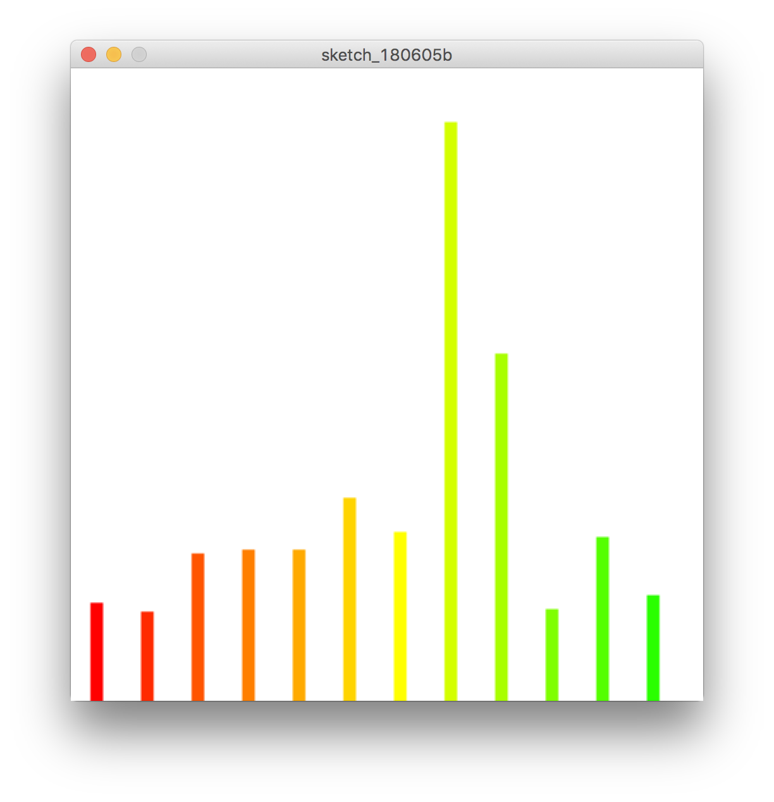
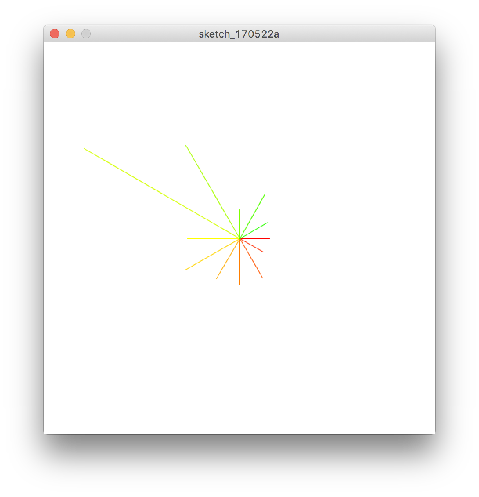
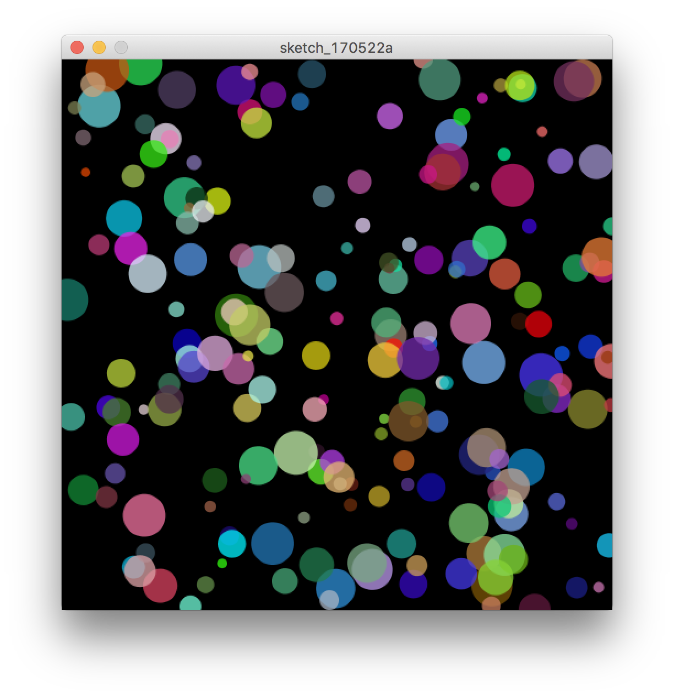

# 配列
### 配列宣言

```
配列データ型[] 配列の名前 = new 配列データ型[配列の数];
```


&nbsp;
&nbsp;

### int型配列

```
// 配列の作成
int[] myArr = new int[5];
// 配列myArrにデータを保存
myArr[0] = 10;
myArr[1] = 20;
myArr[2] = 30;
myArr[3] = 15;
myArr[4] = 5;

println(myArr[1]);
// コンソールの結果は20
```


&nbsp;
&nbsp;

### 宣言を省略した記述方法

```
int[] myArr = {10,20,30,15,5};
```


&nbsp;
&nbsp;


**length**

配列の数を調べる

```
myArr.length
```


&nbsp;
&nbsp;

## サンプルコード

### 降水量を元にグラフを作成する

```
// 東京都　2016年（月ごとの合計）降水量(mm)配列
float[] tokyoRainfall = {77.5,70.5,117.0,119.5,119.5,160.5,134.0,458.0,274.5,73.0,129.5,84.0};

void setup(){
  size(500,500);
  background(255);
  colorMode(HSB, 360, 100, 100);
  
  for(int i=0; i < tokyoRainfall.length; i+=1){
    strokeWeight(10);
    strokeCap(SQUARE);
    stroke(i*10,100,100);    
    line(i * 40 + 20, 500, i * 40 + 20, 500 - tokyoRainfall[i]);
  }
}
```



```
// 東京都　2016年（月ごとの合計）降水量(mm)配列
float[] tokyoRainfall = {77.5,70.5,117.0,119.5,119.5,160.5,134.0,458.0,274.5,73.0,129.5,84.0};

void setup(){
  size(500,500);
  background(255);
  colorMode(HSB, 360, 100, 100);
  
  // 座標を画面の真ん中基点にする
  translate(width/2, height/2);

  for(int i=0; i < tokyoRainfall.length; i+=1){
    strokeWeight(1);
    stroke(i*10,100,100);

    // 半径
    float radius = map(tokyoRainfall[i],0,600,0,300);

    // 角度をラジアンに変える
    float angle = radians(i * 30);
    float x = radius * cos(angle);
    float y = radius * sin(angle);
    line(0,0,x,y);
  }
}

```



&nbsp;

### カラフルな円が動き回る

```
int NUM = 200; // 円の個数
// 座標の配列
float[] posX = new float[NUM];
float[] posY = new float[NUM];
// スピードの配列
float[] speedX = new float[NUM];
float[] speedY = new float[NUM];
// 色の配列
color[] col = new color[NUM];
// 直径の配列
float[] diameter = new float[NUM];


void setup() {
    size(500, 500);
    noStroke();
    // 配列の初期値
    for(int i=0; i<NUM; i++){
        posX[i] = random(8,width);
        posY[i] = random(8,height);
        speedX[i] = random(-4,4);
        speedY[i] = random(-4,4);
        col[i] = color(random(255),random(255),random(255),192);
        diameter[i] = random(8,40);
    }
}


void draw() {
    background(0);

    for(int i=0; i<NUM; i++){
        noStroke();
        fill(col[i]);
        ellipse(posX[i], posY[i], diameter[i], diameter[i]);
        
        // XY座標の移動
        posX[i] = posX[i] + speedX[i];
        posY[i] = posY[i] + speedY[i];

		 // 跳ね返り
        if(posX[i] < 0 || posX[i] > width){
            speedX[i] = speedX[i] * -1;
        }
        if(posY[i] < 0 || posY[i] > height){
            speedY[i] = speedY[i]* -1;
        }
    }
}
```




&nbsp;

&nbsp;
&nbsp;