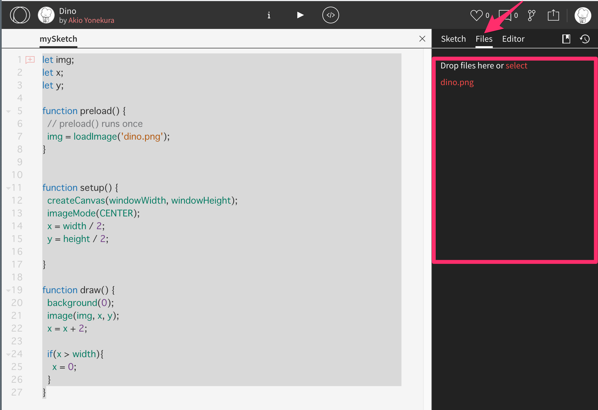
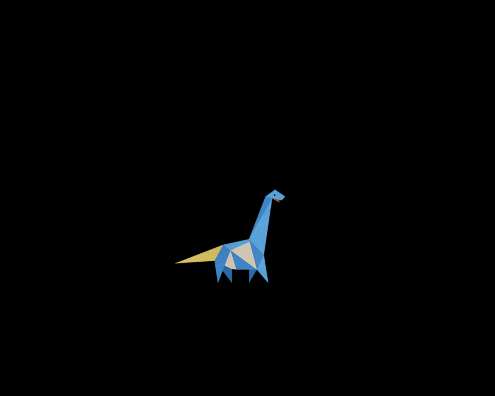

# 画像


## Image

### preload

画像の先読み。setupよりも先に画像を読み込む

```
function preload() {
  // preload() runs once
  img = loadImage('aDefense.jpg');
}

```
&nbsp;
&nbsp;


### image()
画像の表示

`image(変数, x, y)`

`image(変数, x, y, width, height)`

&nbsp;
&nbsp;

## サンプルコード


1. OpenProcessingにログイン（初回はサインイン）
2. `Create a Sketch`から新規プロジェクトを作成
3. 右上の設定から`Files`を選び画像をドロップする




```
let img; //画像を保存する変数
let x; //X座標
let y; //Y座標

function preload() {
	// setupよりも先に画像を読み込む
	img = loadImage('dino.png');
}


function setup() {
	createCanvas(windowWidth, windowHeight);
	imageMode(CENTER); //画像の基準値を中央に
	x = width / 2;
	y = height / 2;

}

function draw() {
	background(0);
	image(img, x, y); //イメージの読み込み
	x = x + 2;
	
	if(x > width){
		x = 0;
	}
}

```
