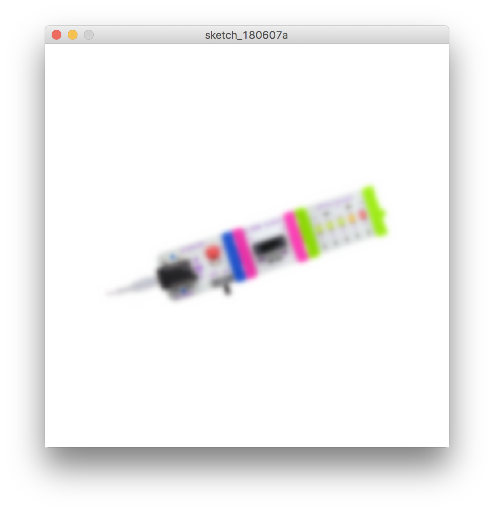

# 画像

1. sketchフォルダ内に「data」フォルダを作り画像ファイルを入れる。
2. PImage変数を作成
3. loadImage()で画像データを読み込み
4. image()で表示する


```
// 画像を読み込む変数
PImage littleBits;

void setup(){
  size(500,500);
  background(255);
  colorMode(HSB,360,100,100);
  
  // 変数に画像ファイルをロードする
  littleBits = loadImage("littleBits.png");
  
  // 画像の基点をセンターに
  imageMode(CENTER);
  // 赤く塗る
  tint(0,100,100); 
  // 画像を表示する
  image(littleBits,width/2,height/2,350,150);
  filter(BLUR,3); // ぼかしフィルター
 
}


```

