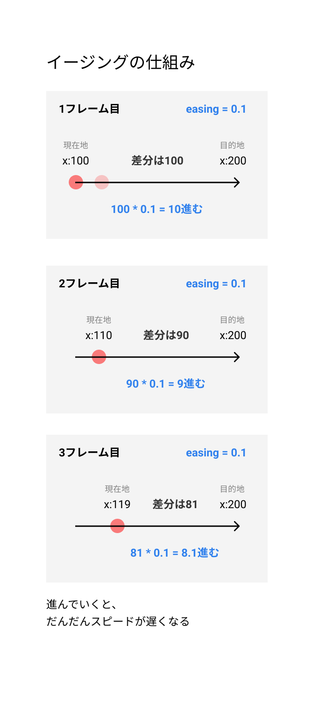
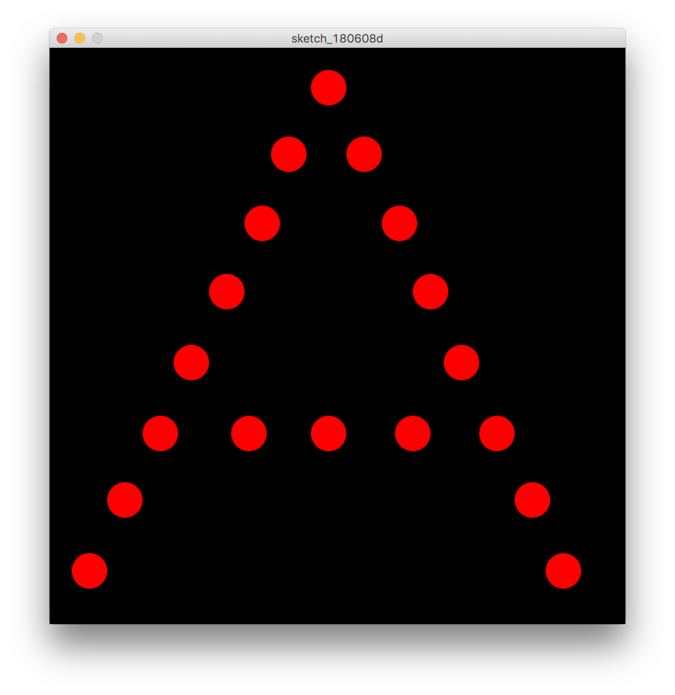
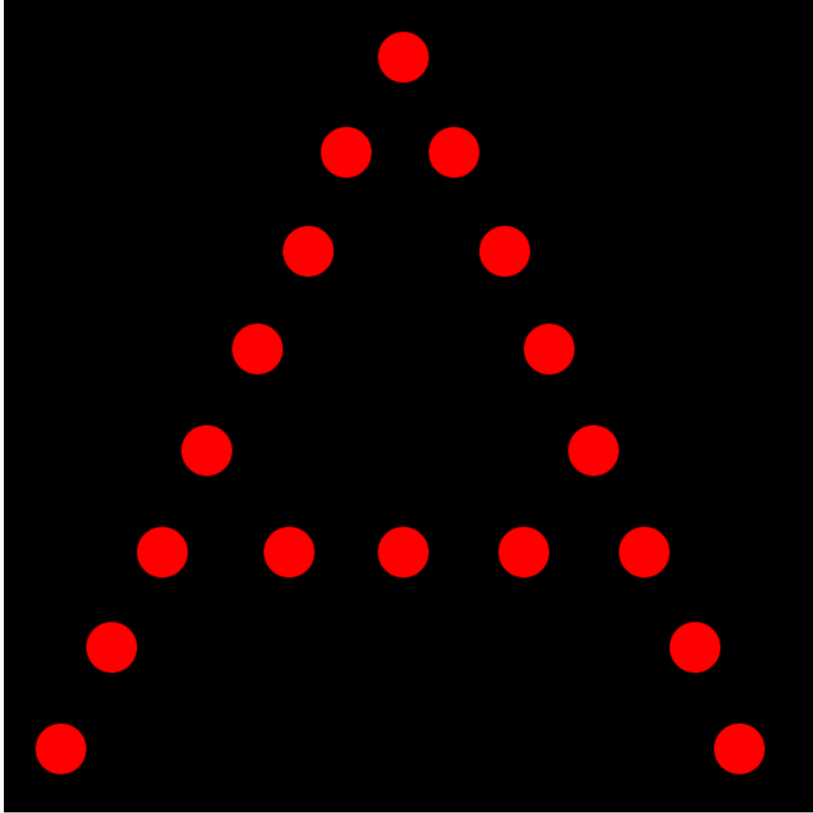

# イージング


## 目的値へ向かうイージングアニメーション



```
// 円の座標
let x;
let y;
// 目的地の座標
let targetX;
let targetY;

const easing = 0.05;

function setup() {
  createCanvas(600, 600);
  noStroke();
  // グローバル変数に初期値を代入
  x = 0;
  y = 0;
  targetX = 400;
  targetY = 400;
}

function draw() {
  background(0);
  
  // 現在の位置と目的地の差分（距離）
  let distanceX = targetX - x;
  let distanceY = targetY - y;
  
  //現在のX座標に距離を足していく、イージングでスピードに変化を加える
  x = x + distanceX * easing;
  y = y + distanceY * easing;
  
  //　塗りと円の描画
  fill(255,0,0);
  circle(x, y, 40);
}
```


&nbsp;
&nbsp;


## クリックでマウス位置へ戻るアニメーション

```
// 円の座標
let x;
let y;
// 目的地の座標
let targetX;
let targetY;

const easing = 0.05;

function setup() {
  createCanvas(600, 600);
  noStroke();
  // グローバル変数に初期値を代入
  x = width / 2;
  y = height / 2;
  targetX = width / 2;
  targetY = height / 2;
}

function draw() {
  background(0);

  // 現在の位置と目的地の差分（距離）
  let distanceX = targetX - x;
  let distanceY = targetY - y;

  //現在のX座標に距離を足していく、イージングでスピードに変化を加える
  x = x + distanceX * easing;
  y = y + distanceY * easing;

  //　塗りと円の描画
  fill(255, 0, 0);
  circle(x, y, 40);
}

function mousePressed() {
  targetX = mouseX;
  targetY = mouseY;
}

```

&nbsp;
&nbsp;


### 目的地へ戻るアニメーション 配列

```
// 円の座標
let x = [];
let y = [];
//円のスピード
let speedX = [];
let speedY = [];
// 目的地の座標
let targetX = [45,85,125,160,200,240,270,315,355,395,430,465,505,545,580,225,315,410,];
let targetY = [590,510,435,355,275,198,120,45,120,198,275,355,435,510,590,435,435,435,];

const easing = 0.05;

// マウスを押しているかどうかのフラグ
let isClick;

function setup() {
  createCanvas(640, 640);
  noStroke();

  // フラグをオフ
  isClick = false;

  // グローバル変数に初期値を代入
  // グローバル配列に初期値を代入
  for (let i = 0; i < targetX.length; i++) {
    x[i] = width / 2;
    y[i] = height / 2;
    speedX[i] = int(random(-8, 8));
    speedY[i] = int(random(-8, 8));
  }
}

function draw() {
  background(0);

  // 現在の位置と目的地の差分（距離）
  let distanceX = [];
  let distanceY = [];
  //　塗りと円の描画
    fill(255, 0, 0);

  for (let i = 0; i < targetX.length; i++) {
    if (isClick == true) {
      // もしフラグがオンだったら

      // 目的地から現在地を引いた差分を距離の配列に保存
      distanceX[i] = targetX[i] - x[i];
      distanceY[i] = targetY[i] - y[i];

      // 現在地に差分を足す
      x[i] = x[i] + distanceX[i] * easing;
      y[i] = y[i] + distanceY[i] * easing;
    } else {
      // もしフラグがオフだったら

      // 座標にスピードを足す
      x[i] += speedX[i];
      y[i] += speedY[i];

      // 跳ね返り
      if (x[i] < 0 || x[i] > width) {
        speedX[i] = speedX[i] * -1;
      }
      if (x[i] < 0 || x[i] > height) {
        speedY[i] = speedY[i] * -1;
      }
    }
    
    circle(x[i], y[i], 40);
  }
}

function mousePressed() {
  isClick = true; // フラグをオン
}

function mouseReleased(){
  isClick = false; // フラグをオフ
}
```

