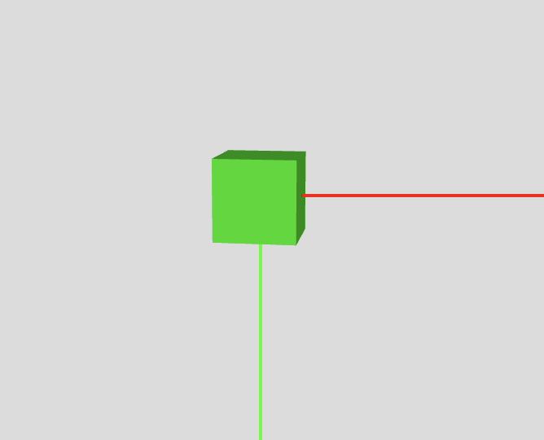
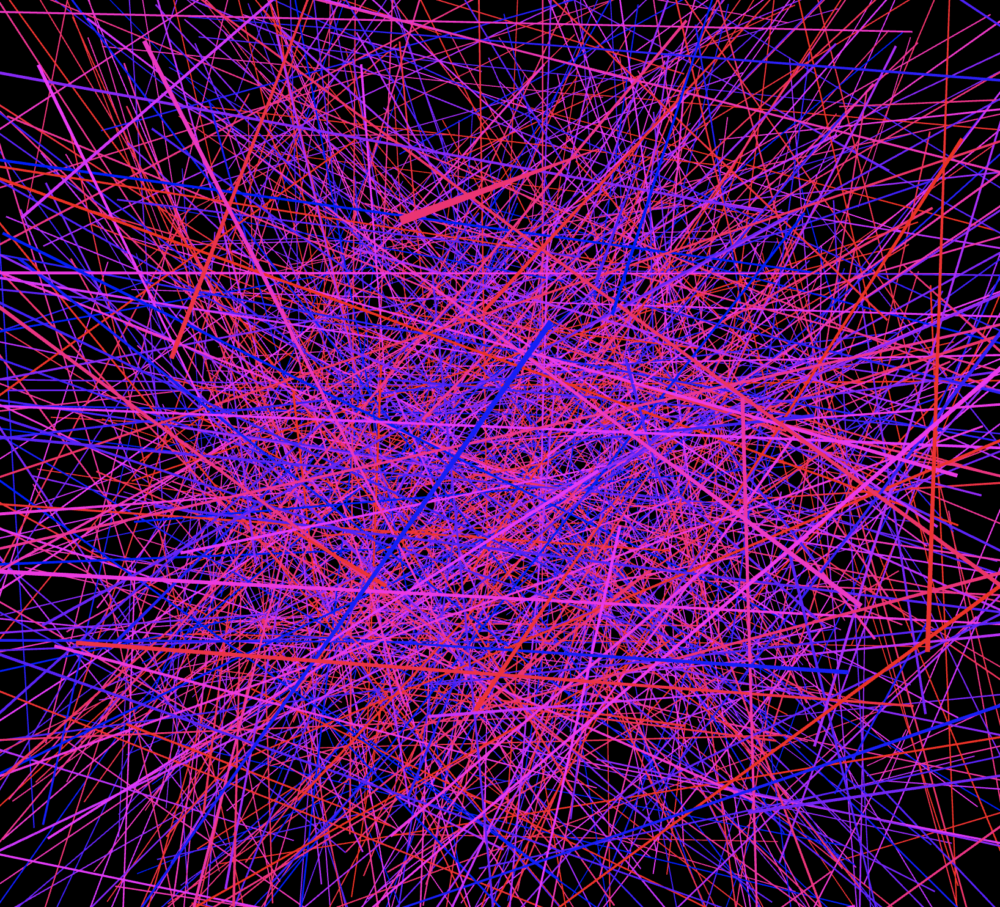
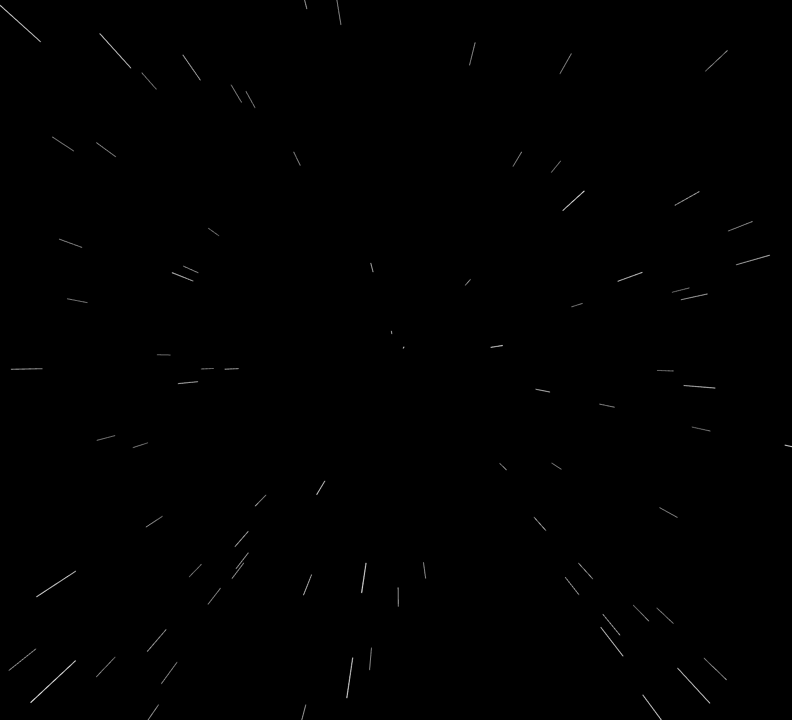

# 3D


createCanvas()に`WEBGL`を追加で記述する。3Dモードに変更するとZ軸が指定できる。中心座標に変わる

```
createCanvas(600, 600, WEBGL);
```
&nbsp;
&nbsp;


### 3Dの回転 rotate

```
let angle; //回転する角度

function setup() {
  createCanvas(600, 600, WEBGL);
  angle = 0;
  debugMode(AXES,1000,0,0,0);//XYZ軸
}

function draw() {
  background(220);
  lights(); //ライト
  orbitControl(); //3D空間を操作できる
  noStroke();
  fill(0, 255, 0);

  // 回転
  rotateX(radians(angle));
  rotateY(radians(angle));
  // plane(200, 200);
  box(50);
  // translate(0,0,0); //座標移動
  // sphere(100);

  angle++;
  if (angle > 360) {
    angle = 0;
  }
  //print(angle);
}

```





&nbsp;
&nbsp;


&nbsp;
&nbsp;

### 線をランダムに配置して回転

```
const NUM = 1000;
let startX = [];
let startY = [];
let startZ = [];
let endX = [];
let endY = [];
let endZ = [];
let col = [];
let angle;
function setup() {
  createCanvas(windowWidth, windowHeight, WEBGL);
  colorMode(HSB, 360, 100, 100);
  angle = 0;

  for (let i = 0; i < NUM; i++) {
    startX[i] = random(-width/2, width/2);
    startY[i] = random(-width/2, width/2);
    startZ[i] = random(-width/2, width/2);
    endX[i] = random(-height/2, height/2);
    endY[i] = random(-height/2, height/2);
    endZ[i] = random(-height/2, height/2);
    col[i] = color(random(240, 360), 100, 100);
  }
}

function draw() {
  background(0);

  orbitControl();
  noFill();

  // 回転
  rotateX(radians(angle));
  for (let i = 0; i < NUM; i++) {
    stroke(col[i]);
    line(startX[i], startY[i], startZ[i], endX[i], endY[i], endZ[i]);
  }

  angle += 0.2;
  if (angle > 360) {
    angle = 0;
  }
}

```



&nbsp;
&nbsp;


### Z座標を使ったアニメーション


```
const NUM = 100;
let x = [];
let y = [];
let z = [];
function setup() {
  createCanvas(windowWidth, windowHeight, WEBGL);
  for (let i = 0; i < NUM; i++) {
    x[i] = random(width * -1, width);
    y[i] = random(height * -1 , height);
    z[i] = i * -10;
  }
}

function draw() {

  background(0);
  stroke(255);
  for (let i = 0; i < NUM; i++) {
    line(x[i], y[i], z[i], x[i], y[i], z[i] - 100);
    z[i] += 20;

    if (z[i] > 0) {
      x[i] = random(width * -1, width);
      y[i] = random(height * -1 , height);
      z[i] = -1000;
    }
  }
}
```




&nbsp;
&nbsp;