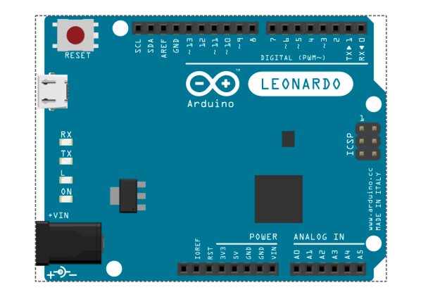
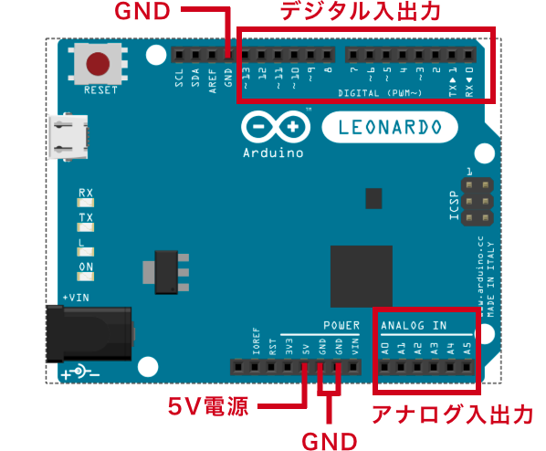
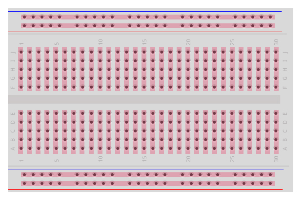
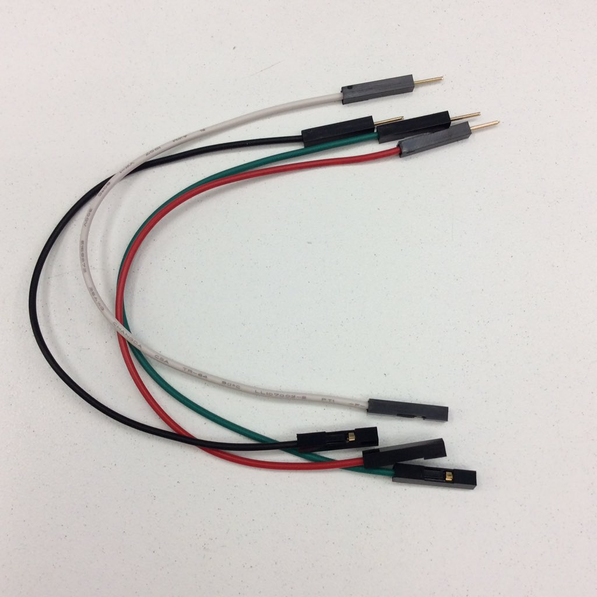
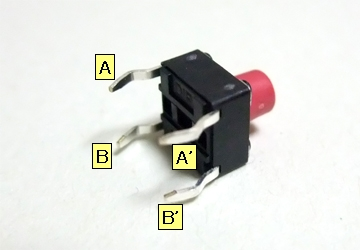
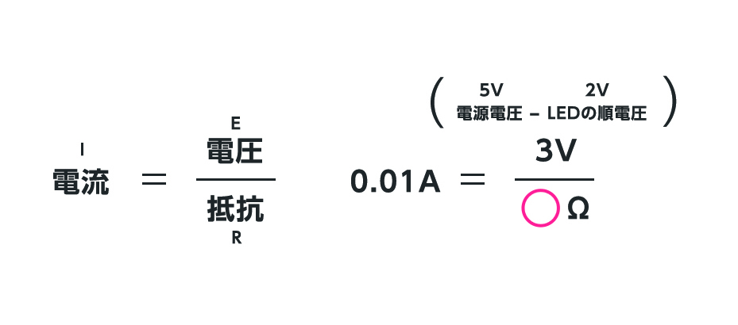
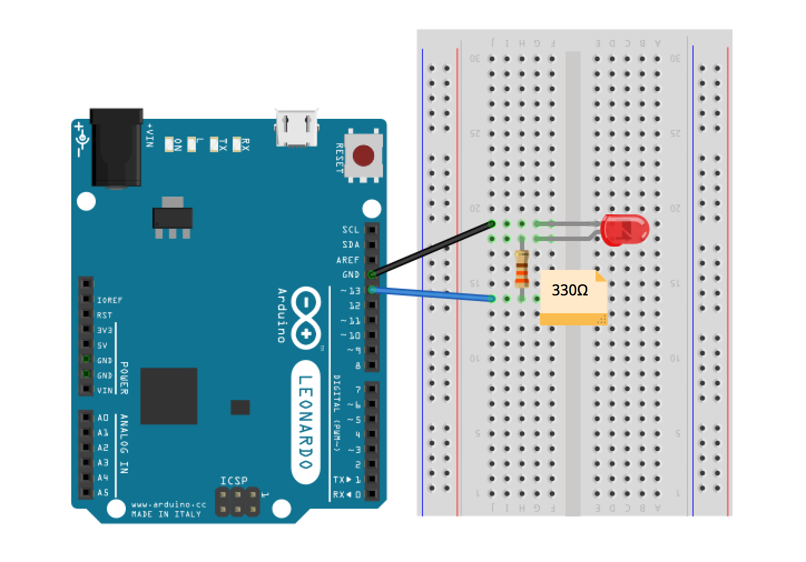
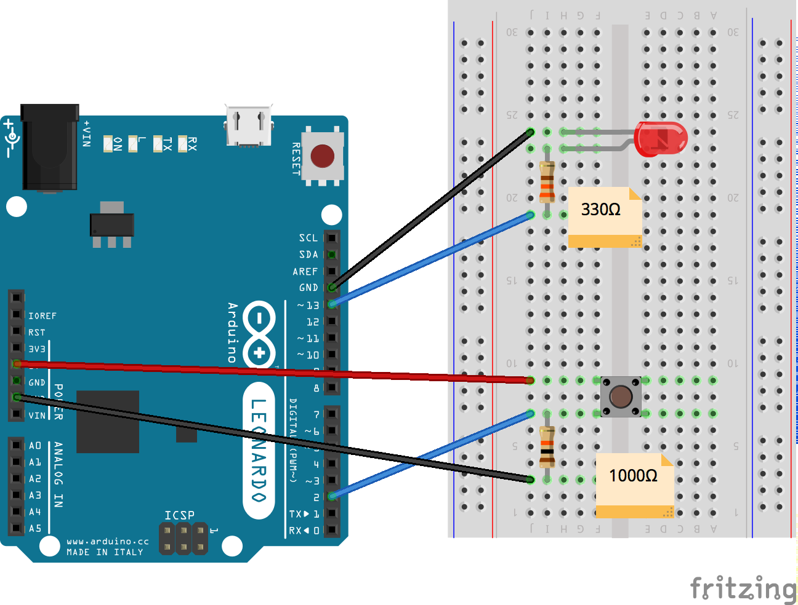
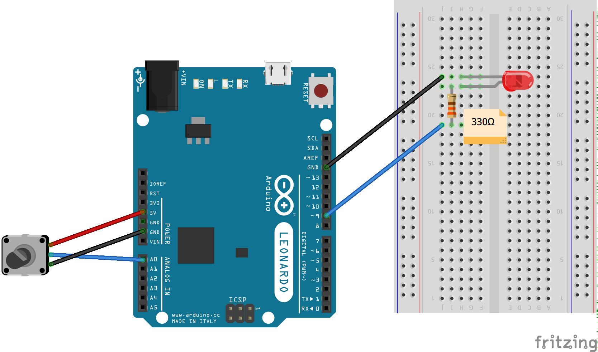
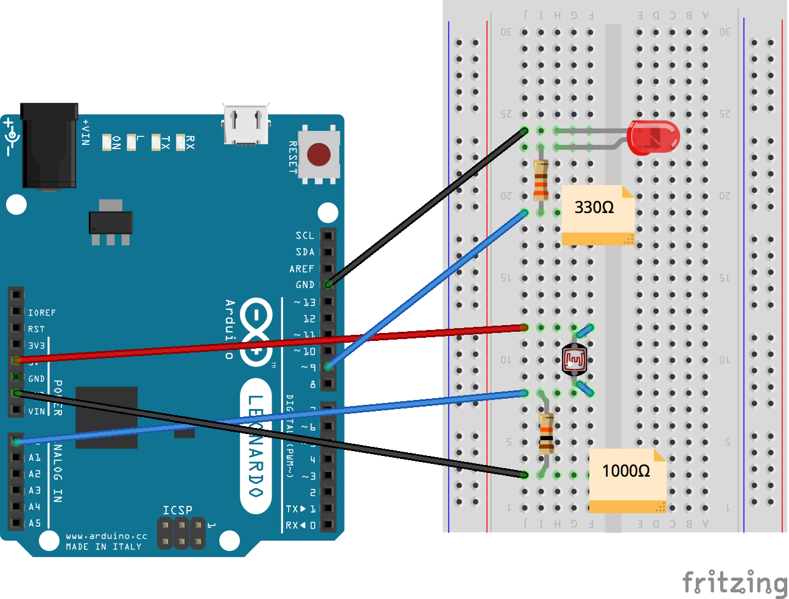

# Aruduinoとは

ArduinoはLEDやセンサーなどの電子部品をUSBを通じて、プログラミングで制御をすることのできるコンピュータです。フィジカルコーンピューティングと呼ばれて、Processing、openFrameworks、Max/MSPなどと連動して身体的にインタラクティブなコンテンツを開発することができます。



### 公式サイト
[https://www.arduino.cc/](https://www.arduino.cc/)

&nbsp;

### Aruduinoの種類  
[https://www.arduino.cc/en/Main/Products](https://www.arduino.cc/en/Main/Products)

- Aruduino UNO 3,240円  
- Arduino Leonardo 3,024円
- Arduino Fio（ワイヤレス）3117円
- LilyPad Arduino 328（服に縫い付ける） 2,492円

※ピンの数、動作電圧、メモリーの容量が違います。

<!--
### UNOとLEONARDOの違い
- Leonardoの方がI/Oが多い
- KeyboardやMouseデバイスが簡単に作れる
- 標準USB-Type B-->


&nbsp;


## Aruduino基盤

#### アナログ入力
 * A0番〜A5番
 * 電圧0V〜5Vを0〜1023の数値で読み取れる

#### デジタル入出力
* 0番〜13番




Arduino Leonardo仕様  
[https://www.arduino.cc/en/main/arduinoBoardLeonardo](https://www.arduino.cc/en/main/arduinoBoardLeonardo)

&nbsp;


### ブレッドボード

テスト用の簡易基盤ピンクの線がつながっている箇所は内部でつながっている




&nbsp;

### ジャンパワイヤー
電流の流れを作る  



例えば、黒：GND、赤：電源などルールを作って組むと判別しやすくなる

&nbsp;

## 電子部品

#### LED


* 定格電圧`2V`
* 定格電流`10mA`
* 長いほうが`+`  短いほうが`-`  

&nbsp;

#### タクトスイッチ


AとA'はつながっている  
BとB'はつながっている

スイッチを押している間は全部つながる
&nbsp;

#### CdSセル（光センサー）


&nbsp;


#### 抵抗

 330Ω、1KΩ
 
[抵抗のカラーコード（抵抗値）の読み方](http://www.jarl.org/Japanese/7_Technical/lib1/teikou.htm)


* 150Ω（茶緑茶金、青色や白色LEDの電流制限など） 
* 330Ω（橙橙茶金、赤色や緑色LEDの電流制限など）
* 1kΩ（茶黒赤金、赤色や緑色 LED の電流制限、トランジスタの電流制限など）
* 10kΩ（茶黒橙金、プルアップ、プルダウン、抵抗分圧など）
* 100kΩ（茶黒黄金、フォトインタラプタなど）
* 1MΩ（茶黒緑金、タッチセンサなど）

&nbsp;

#### オームの法則

E（電位差） = R x I

Rの数値を求めるために次の式に変形

R = （5 - 2）/ 0.01 = 300  
※1000Ω = 1kΩ



- 電圧 V（ボルト）  
- 電流 A（単位：アンペア）I  
- 抵抗 Ω（単位：オーム） R  

順電圧とは、LEDにかかる電圧のことで、オームの法則の電圧（R）部分には抵抗にかかる電圧（電位差）を入れる。

※LED 定格電圧2〜3V、定格電流5〜10mA  
※最大定格電流20mA  
※ぴったりの抵抗値をもつ抵抗器があるとは限らないので、近いものを使う。


&nbsp;
&nbsp;


## プロトタイピング

#### LEDを点滅 




```
// LEDに接続したピンの番号
int led = 13;


void setup() {
    // LEDに接続したピンを出力にセット
    pinMode(led, OUTPUT);
}
void loop() {
    // デジタル出力ON
    digitalWrite(led, HIGH);
    // 1000ms待つ
    delay(1000);
    // デジタル出力OFF
    digitalWrite(led, LOW);
    // 1000ms待つ
    delay(1000);
}
```

&nbsp;

#### ボタンでLEDを点滅 

#####  タクトスイッチにも抵抗をつけるのはなぜ？
プルダウン抵抗と言って、誤作動が無く、安定した入力を受け取れるようにする為。




```
// ボタンに接続したピンの番号
int button = 2;

// LEDに接続したピンの番号
int led = 13;

// ボタンの状態を表す変数
int buttonState = 0;

void setup() {
    // LEDに接続したピンを出力にセット
    pinMode(led, OUTPUT);
    // ボタンに接続したピンを出力にセット
    pinMode(button, INPUT);
}

void loop() {
    // ボタンに接続したピンの状態を読み取る
    buttonState = digitalRead(button);

    // ボタンの状態がHIGHであれば
    if (buttonState == HIGH) {
        // LEDに接続したピンの値をHIGHにセットしてLEDを点灯
        digitalWrite(led, HIGH); 
    } else {
        // LEDに接続したピンの値をLOWにセットしてLEDを消灯
        digitalWrite(led, LOW);
    }
}

```

&nbsp;

#### 可変抵抗器の調整でLEDを照らす 



※analogWriteが使えるのはPWNマークが付いたポートのみ


```
// 可変抵抗器に接続したピンの番号
int sensor = 0;
// 可変抵抗器から読み取る値
int sensorVal = 0;

// LEDに接続したピンの番号
int led = 9;
// LEDに送信するマッピングした値
int ledVal = 0;

void setup() {
    // LEDに接続したピンを出力にセット
    pinMode(led, OUTPUT);
    // シリアル通信を開始
    Serial.begin(9600);
}

void loop() {
    // 可変抵抗器に接続したピンの値を読み取る
    sensorVal = analogRead(sensor);
    
    // シリアルモニタまたはシリアルプロッタで確認できるよう、シリアルにプリント 
    Serial.println(sensorVal);
    
    // 可変抵抗器の値を元にLEDの明るさを求める
    // 0~1023の入力を0~255の範囲にスケーリング
    ledVal = map(sensorVal, 0, 1023, 0, 255);
    
    // LEDに接続したピンの値をセット 
    analogWrite(led, ledVal);
    
    // 適度な間隔でデータを送信するため、次のループ開始までに100ms待つ
    delay(100);
}
```


&nbsp;

#### CDSセルでLEDを照らす 

暗いとLEDが光り、明るいとLEDが暗くなる




```
// CDSセルに接続したピンの番号
int sensor = 0;
// CDSセルからの値
int sensorVal = 0;

// LEDに接続したピンの番号
int led = 9;
// LEDに送信するマッピングした値
int ledVal = 0;

void setup() {
    // LEDに接続したピンを出力にセット
    pinMode(led, OUTPUT);
    // シリアル通信を開始
    Serial.begin(9600);
}

void loop() {
    // 可変抵抗器に接続したピンの値を読み取る
    sensorVal = analogRead(sensor);
    // シリアルモニタまたはシリアルプロッタで確認できるよう、シリアルにプリント
    Serial.println(sensorVal);
    // 可変抵抗器の値を元にLEDの明るさを求める
    // 0~1023の入力を0~255の範囲にスケーリング
    ledVal = map(sensorVal, 0, 1023, 255, 0);
    // LEDに接続したピンの値をセット 
    analogWrite(led, ledVal);
    // 適度な間隔でデータを送信するため、次のループ開始までに100ms待つ
    delay(100);
}
```