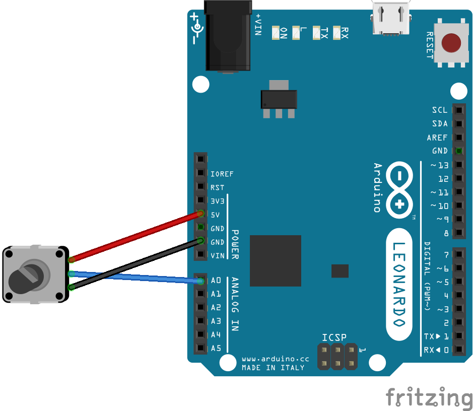
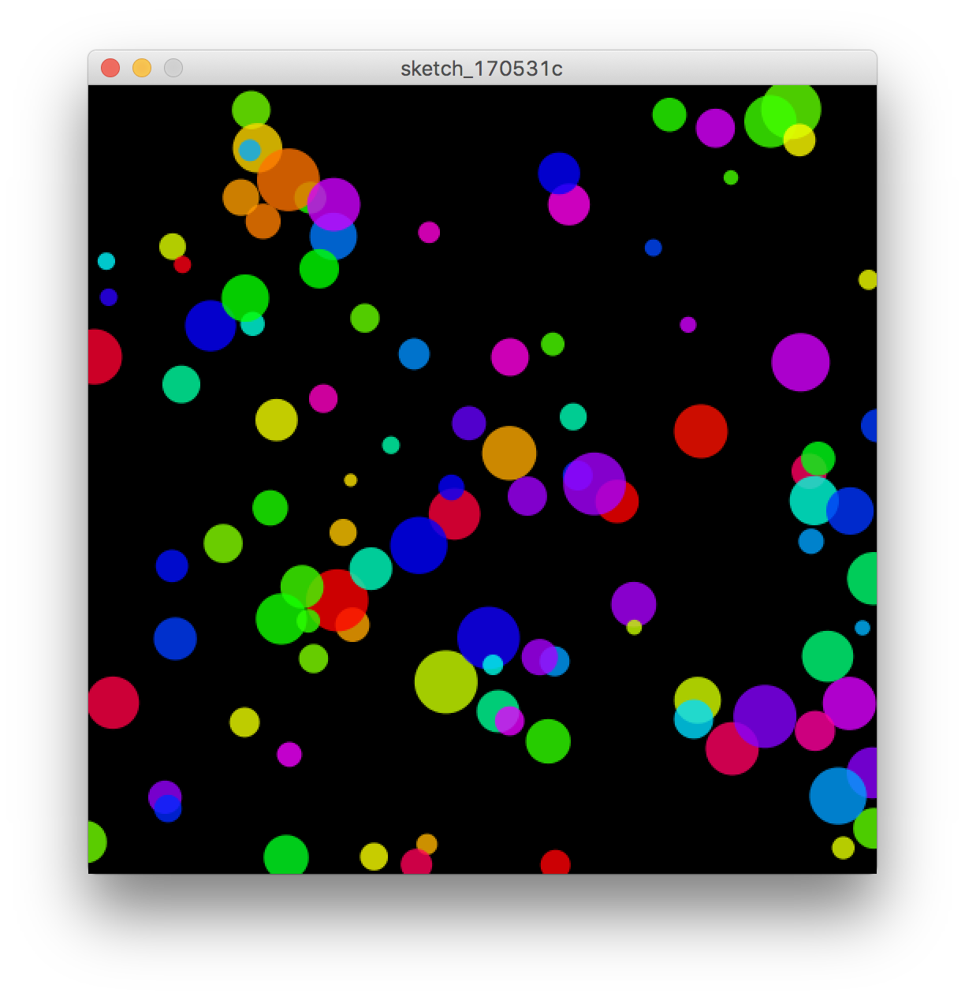
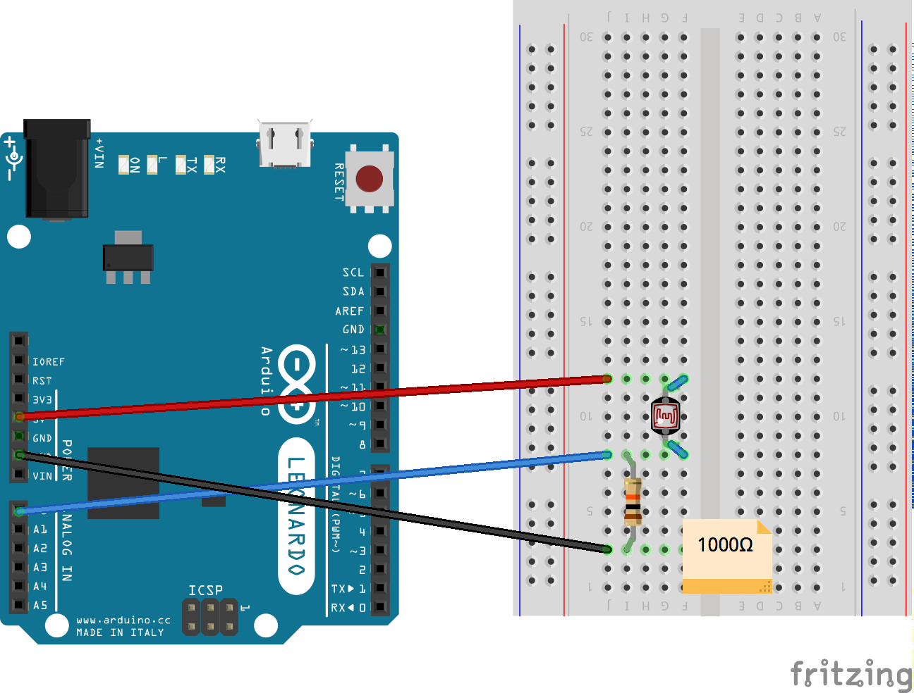
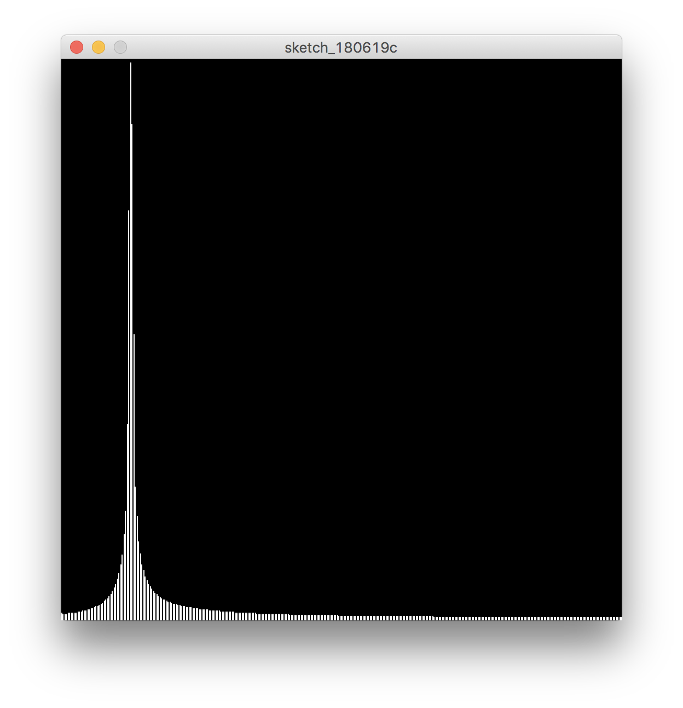
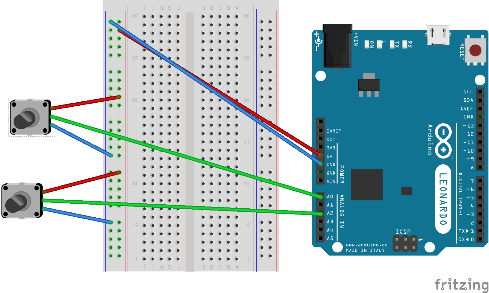
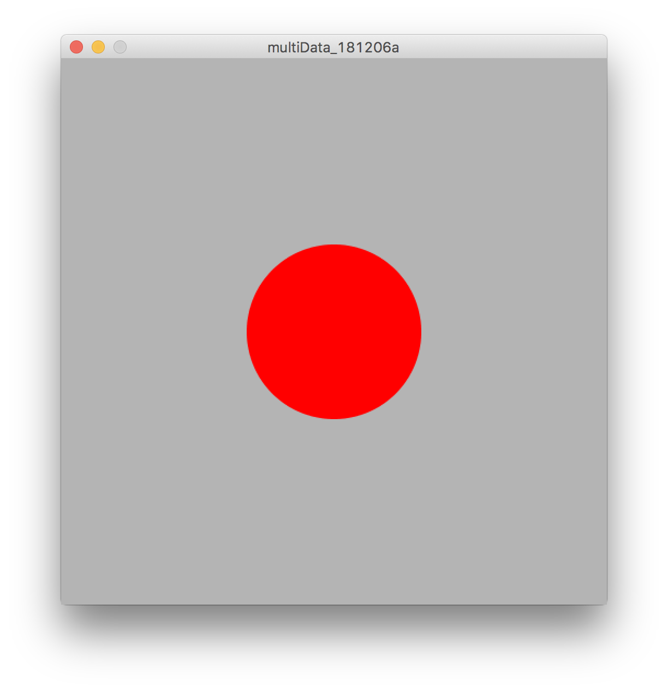

# Arduino / Processing 作例


## 作例1　円の大きさを変える

#### センサー

 * 可変抵抗器

 
 

##### Arduiono

```
int sensor = 0;
int val = 0;
float mapVal = 0;

void setup(){
  // シリアル通信を開始
  Serial.begin(9600);
}

void loop(){
  // 可変抵抗器に接続したピンの値を読み取る
  val = analogRead(sensor);

  // シリアルモニタまたはシリアルモニタで確認できるよう、シリアルにプリント 
  //  Serial.println(val);

  mapVal = map(val,0,1023,0,255);
  Serial.write((byte)mapVal); // byteで値を送信
  
  // 適度な間隔でデータを送信するため、次のループ開始までに100ms待つ
  delay(100);
}

```

&nbsp;

##### Processing 

```
import processing.serial.*;

Serial port; //Arduinoとシリアル通信する変数
float val = 0; // Arduinoからくる値を保存する変数
int mapVal = 0;

void setup() {
  size(500,500);
  background(255);
  
  // 自分のポート番号がSerial.list()配列の何番目かを調べる
  println(Serial.list());
  
  // Serial.list()[]の配列に自分のポート番目をいれる 
  // String arduinoPort = Serial.list()[5];
  String arduinoPort = "/dev/cu.usbmodem14401";
  
  // 変数portにarduinoからの通信を繋ぐ　
  port = new Serial(this, arduinoPort, 9600);
}

void draw() {
  background(255);
  
  // もしArduinoから値が届いていたら
  if (port.available() > 0) {
     // ポートの値をvalに保存
     val = port.read();
     mapVal = (int)map(val,0,255, 20,500);
     println(mapVal);
  }
   
  colorMode(HSB,360,100,100,100);
  noStroke();
  fill(45,100,100,100);
  ellipse(width/2, height/2, mapVal, mapVal);
}
```


&nbsp;

### Arduinoから受け取る値をイージングで滑らかにする 

##### Processing 

```
import processing.serial.*;

Serial port; //Arduinoとシリアル通信する変数
float val = 0; // Arduinoからくる値を保存する変数
int mapValue = 0;
float easing = 0.05; // イージング
float easeValue = 0; // valueをイージングで滑らかにした値

void setup() {
  size(500,500);
  background(255);
  
  // 自分のポート番号がSerial.list()配列の何番目かを調べる
  println(Serial.list());
  
  // Serial.list()[]の配列に自分のポート番目をいれる 
  String arduinoPort = Serial.list()[5];
  
  // 変数portにarduinoからの通信を繋ぐ　
  port = new Serial(this, arduinoPort, 9600);
}

void draw() {
  background(255);
  
  // もしArduinoから値が届いていたら
  if (port.available() > 0) {
     // ポートの値をvalに保存
     val = port.read();
     mapValue = (int)map(val,0,255, 20,500);
     println(mapValue);
  }
  
  // 目的地へのイージング
  float targetValue = mapValue;
  easeValue += (targetValue - easeValue) * easing; 
   
  colorMode(HSB,360,100,100,100);
  noStroke();
  fill(45,100,100,100);
  ellipse(width/2,height/2,easeValue,easeValue);
}
```


&nbsp;


### 作例2　円の数を変える

#### processing

```
import processing.serial.*;

Serial port; //Arduinoとシリアル通信する変数
float val = 0; // Arduinoからくる値を保存する変数
float easing = 0.05; // イージング
float easeValue = 0; // valueをイージングで滑らかにした値


int NUM = 255; // 円の個数
// 座標の配列
float[] posX = new float[NUM];
float[] posY = new float[NUM];
// スピードの配列
float[] speedX = new float[NUM];
float[] speedY = new float[NUM];
// 色の配列
color[] col = new color[NUM];
// 直径の配列
float[] diameter = new float[NUM];


void setup() {
    size(500, 500);
    
    // 自分のポート番号がSerial.list()配列の何番目かを調べる
    //println(Serial.list());
    
    // Serial.list()[]の配列に自分のポート番目をいれる 
    String arduinoPort = Serial.list()[5];
    
    // 変数portにarduinoからの通信を繋ぐ　
    port = new Serial(this, arduinoPort, 9600);
    
    
    // 配列の初期値
    for(int i=0; i<NUM; i++){
        posX[i] = random(8,width);
        posY[i] = random(8,height);
        speedX[i] = random(-4,4);
        speedY[i] = random(-4,4);
        col[i] = color(random(255),random(255),random(255),192);
        diameter[i] = random(8,40);
    }
}


void draw() {
    background(0);
    
    // もしArduinoから値が届いていたら
    if (port.available() > 0) {
       // ポートの値をvalに保存
       val = (int)port.read();
       println(val);
    }
    // 目的地へのイージング
    //float targetValue = val;
    //easeValue += (targetValue - easeValue) * easing;

	// for文の上限をシリアルから伝達されるvalueに置き換える
    for(int i=0; i<val; i++){
        noStroke();
        fill(col[i]);
        ellipse(posX[i], posY[i], diameter[i], diameter[i]);
        
        // XY座標の移動
        posX[i] = posX[i] + speedX[i];
        posY[i] = posY[i] + speedY[i];

     // 跳ね返り
        if(posX[i] < 0 || posX[i] > width){
            speedX[i] = speedX[i] * -1;
        }
        if(posY[i] < 0 || posY[i] > height){
            speedY[i] = speedY[i]* -1;
        }
    }
}
```



&nbsp;


## 作例3　光センサーでテルミン



##### Arduiono

```
// 可変抵抗器に接続したピンの番号
int sensor = 0;
int val = 0;
int mapVal = 0;

void setup() {
    // シリアル通信を開始
    Serial.begin(9600);
}

void loop() {
    // CDSセルに接続したピンの値を読み取る
    val = analogRead(sensor);
    // シリアルモニタまたはシリアルプロッタで確認できるよう、シリアルにプリント 
    //Serial.println(val);
    // 可変抵抗器の値を元にLEDの明るさを求める
    // 0~1023の入力を0~255の範囲にスケーリング
    mapVal = map(val, 0, 1023, 0, 255);
    Serial.write((byte)mapVal); // byteで値を送信
    
    // 適度な間隔でデータを送信するため、次のループ開始までに100ms待つ
    delay(100);
}

```

##### Processing


```
import processing.sound.*;
import processing.serial.*;

Serial port; //シリアル型の変数
float val = 0; //Arduinoから受け取る値

float easing = 0.05; //イージング
float easeVal = 0; // イージングで滑らかにした値


SinOsc osc; //サイン波
float freq; //周波数
int noteNumber;

FFT fft; // 高速フーリエ変換
int bands = 1024; // FFTのサイズ


void setup(){
  size(512,512);
  background(0);
  
  //自分のポート番号を確認
  //println(Serial.list()); 5番
  String arduinoPort = Serial.list()[5]; //シリアルの箇所
  port = new Serial(this, arduinoPort, 9600); //Arduinoとの接続
  
  osc = new SinOsc(this); //サイン波の生成
  osc.play(); //再生
  
  freq = 440; //周波数の代入
  noteNumber = 60; //ド
  
  fft = new FFT(this, bands); // FFTを生成
  fft.input(osc); //オシレーターの値を周波数変換
}

void draw(){
  background(0);
  
  // もしArduinoから値が届いていたら
  if(port.available() > 0){
    val = (int) port.read(); //ポートから来た値を保存
    println(val);
    val = map(val, 0, 255, 10.0, 126.0); //座標からノートナンバーへ
  }
  
  // 目的地へのイージング
  float targetVal = val;
  easeVal += (targetVal - easeVal) * easing;
  
  osc.freq(midiToFreq(easeVal)); //ポートから来た値をMidiから周波数に変換して音階を決める
  
  noFill();
  stroke(255);
 
  fft.analyze(); //FFTの解析
  //周波数毎の分布を線で表現
  for(int i=0; i<bands; i++){
    line(i, height, i, height - fft.spectrum[i]*height*4); 
  }
}


// ノートナンバーから周波数に変換する関数
float midiToFreq(float note){
  float freqVal = (pow(2, ((note-69)/12.0)))*440;
  return freqVal;
}
```
 



&nbsp;


## 作例4　複数の値を取得




##### Arduiono

```
int a0 = 0; //可変抵抗器のピン
int a0Val = 0; //可変抵抗器の値を保存する変数
float a0MapVal;
int a2 = 2;
int a2Val = 0;
float a2MapVal;

void setup() {
  Serial.begin(9600);
}

void loop() {
  a0Val = analogRead(a0); //可変抵抗器の値を読む
  a2Val = analogRead(a2);
//  Serial.println(a2Val);
  
  //可変抵抗器の0-1023の値を0-255に変換
  a0MapVal = map(a0Val, 0, 1023, 0, 255);
  a2MapVal = map(a2Val, 0, 1023, 0, 255);

  //シリアル送信 Processingに送る
  Serial.print(a0MapVal);
  Serial.print(",");
  Serial.print(a2MapVal);
  Serial.print("\n");
  
  delay(100);
}
```

##### Processing


```
import processing.serial.*;

Serial port; //Arduinoとシリアル通信する変数
float []arduinoData = new float[3];

void setup() {
  size(500,500);
  background(255);
  
  // 自分のポート番号がSerial.list()配列の何番目かを調べる
  //println(Serial.list());
  
  // Serial.list()[]の配列に自分のポート番目をいれる 
  String arduinoPort = Serial.list()[5];
  
  // 変数portにarduinoからの通信を繋ぐ　
  port = new Serial(this, arduinoPort, 9600);
}

void draw() {
  background(255);
  
  // もしArduinoから値が届いていたら
  if (port.available() > 0) {
     //複数の値を文字列にまとめて受信
     String inString = port.readStringUntil('\n');
     
     if(inString != null){
       //文字列から改行\nを削除
       inString = trim(inString); 
       //,区切りで配列に保存
       arduinoData = float(split(inString, ',')); 
       println(arduinoData);
     }
     //println(inString); arduinoData[0], arduinoData[1]となる
  }
   
  colorMode(HSB,360,100,100,100);
  noStroke();
  fill(arduinoData[0],100,100,100);
  ellipse(width/2, height/2, arduinoData[1], arduinoData[1]);
}
```
 



