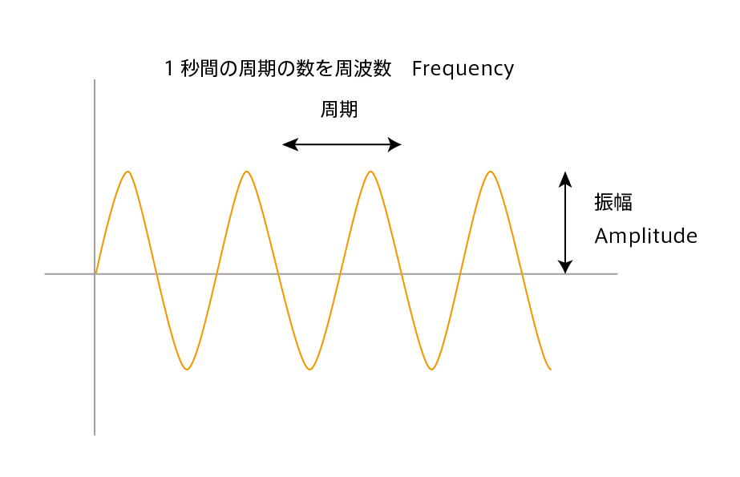
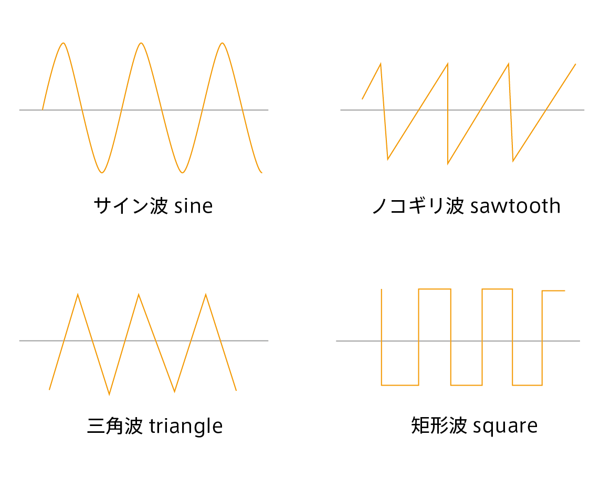
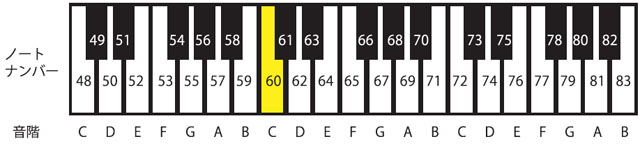

# シンセサイザー


## 音響合成

音は空気の振動。空気中に「波」として耳に伝わる（音波）
コンピュータでデジタル音を生成するには波形を作る。

* 振幅（Amplitude）が音の大きさ
* 周波数（Frequency）が音の高さ
 
 


&nbsp;
&nbsp;

 
### オシレーター Oscillator

オシレーターと呼ばれる周波数の波を発振する仕組みで音を生成する
波の種類で音が変わる
 
 



```
let osc; //サイン波
let freq; // 周波数

function setup() {
  createCanvas(512, 512);
  freq = 440;
  osc = new p5.Oscillator("sine");
  osc.start();

}

function draw() {
  background(220);
  osc.freq(freq);
}

```

* サイン波 SinOsc
* ノコギリ波 SawOsc
* 三角波 TriOsc
* 矩形波 SqrOsc


&nbsp;


### MIDIノート番号と周波数

音階を周波数に変換する MIDI to Frequency




```

let osc;
let freq;
let noteNumber;
function setup() {
  createCanvas(400, 400);
  freq = 440;
  osc = new p5.Oscillator("sine");
  osc.start();
  osc.amp(0.5);

  noteNumber = 48;
}

function draw() {
  background(220);

  noteNumber = map(mouseY, 0, height, 48, 83);

  osc.freq(midiToFreq(noteNumber));
}

// ノートナンバーから周波数に変換する関数
function midiToFreq(note) {
  let freqVal = pow(2, (note - 69) / 12.0) * 440;
  return freqVal;
}

```